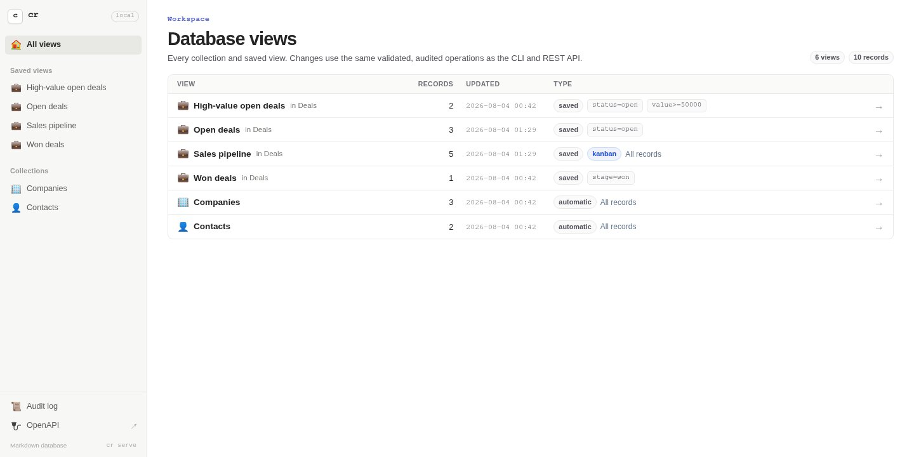
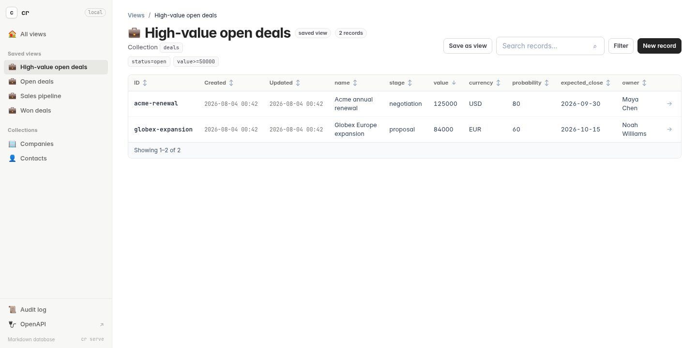
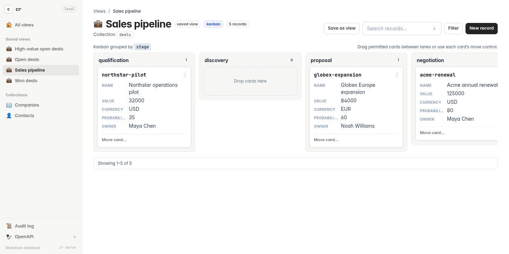
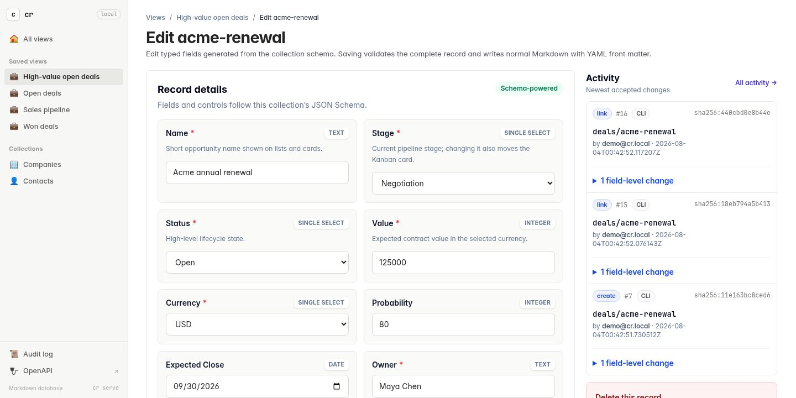
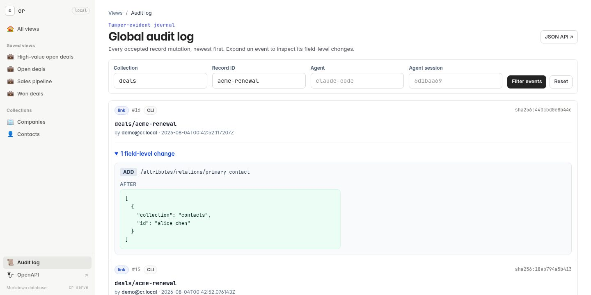

<div align="center">
  <h1>cr</h1>
  <p><strong>A local-first database made from Markdown.</strong></p>
  <p>Typed front matter · audited changes · CLI · REST API · server-rendered views</p>
  <p>
    <a href="#quick-start">Quick start</a> ·
    <a href="#see-it-in-action">Screenshots</a> ·
    <a href="#how-records-work">Data model</a> ·
    <a href="#serve-the-database-over-http">HTTP API</a> ·
    <a href="TODO.md">Roadmap</a>
  </p>
</div>



`cr` turns a folder of ordinary Markdown files with YAML front matter into a queryable database. Choose any collections and fields, then use the same project as a CRM, applicant tracking system, project tracker, knowledge base, or another custom data tool.

> Your editor can edit it. Git can diff it. `cr` can validate, query, audit, sync, and serve it.

| Own the source | Model what you need |
| --- | --- |
| Each record is a readable Markdown file. Direct edits are first-class and reviewed with `cr status` and `cr save`. | Collections and typed YAML fields are arbitrary, with optional JSON Schema validation and relationships. |
| **Query everywhere** | **Trust the history** |
| Filter, compare, sort, search, and page through the same data from the CLI, REST API, tables, or Kanban boards. | Every accepted create, update, link, move, direct edit, sync, and delete extends a tamper-evident audit chain. |

## See it in action

<table>
  <tr>
    <td width="50%">
      
      <br><sub><strong>Saved tables</strong> — searchable, filterable, sortable, and editable.</sub>
    </td>
    <td width="50%">
      
      <br><sub><strong>Kanban pipelines</strong> — moving a card updates and audits its grouping property.</sub>
    </td>
  </tr>
  <tr>
    <td width="50%">
      
      <br><sub><strong>Record history</strong> — actor, source, timestamp, and field-level changes.</sub>
    </td>
    <td width="50%">
      
      <br><sub><strong>Global audit log</strong> — filtered, paginated, and independently verifiable.</sub>
    </td>
  </tr>
</table>

## Quick start

You need a current Rust toolchain. Install the CLI from this repository:

```sh
cargo install --path .
```

Confirm that the command is available:

```sh
cr --help
```

During development, use `cargo run --` instead of the installed command—for example, `cargo run -- --help`.

The repository includes a complete CRM with companies, contacts, deals, relationships, schemas, audit history, saved tables, and a Kanban pipeline:

```sh
cr --database examples/crm audit verify
cr --database examples/crm serve
```

Open [http://127.0.0.1:3000/](http://127.0.0.1:3000/) for the database home, `/deals` for open deals, `/pipeline` for Kanban, or `/audit` for the journal. Browser forms write through the same validated, audited operations as the CLI and REST API.

The sections below cover the complete CLI and HTTP surface. Planned work—including nested Boolean expressions, projections, relationship traversal, and indexes—is tracked in [`TODO.md`](TODO.md).

## Create your first database

Initialize a new database and enter its directory:

```sh
cr init ./my-database
cd ./my-database
```

The new directory contains:

```text
my-database/
├── .cr/
│   ├── audit/
│   ├── schemas/
│   ├── sync/
│   ├── syncs/
│   └── views/
└── records/
```

- `records/` contains your Markdown records.
- `.cr/audit/` contains the audit journal.
- `.cr/schemas/` can contain optional validation rules.
- `.cr/syncs/` contains versioned external sync definitions; `.cr/sync/` holds their checkpoints and locks.
- `.cr/views/` contains optional saved web views.
- `.cr/` identifies the database root.
- `.cr/config.yaml` is optional and contains only overrides from the defaults.

Without a config file, `cr` uses format version 1, stores records under `records/`, and rotates audit segments after 256 events or 8 MiB. Add only the settings you want to change; omitted fields retain their defaults:

```yaml
data_dir: content/data
audit:
  segment_max_events: 500
```

`data_dir` must be a relative path inside the database, and every directory `cr`
opens beneath the root must be a real directory rather than a symbolic link.
That includes `records/`, each collection directory, `.cr/`, and everything
under it. A link anywhere in the chain is refused with an error naming the
record, collection, or view involved; the database itself may still be reached
through a linked path, because the root is resolved once before any of this
applies.

Commands search the current directory and its parents for a database. If you are elsewhere, pass its path explicitly:

```sh
cr --database ./my-database list companies
```

## Set your identity

Audit events include the identity responsible for the change. The easiest persistent setup is:

```sh
export CR_NAME='Jane Doe'
export CR_EMAIL='jane@example.com'
```

Check the identity that will be recorded:

```sh
cr identity
# Jane Doe <jane@example.com>
```

For one command, override it with `--actor`:

```sh
cr --actor 'admin@example.com' delete companies old-company --yes
```

Identity is resolved from `--actor`, `CR_ACTOR`, `CR_NAME` and `CR_EMAIL`, Git author environment variables, Git `user.name` and `user.email`, `EMAIL`, and finally the operating-system username.

This provides attribution, not cryptographically authenticated identity. For stronger assurance, store signed audit checkpoints outside the database.

## How records work

A record is identified by its collection and ID:

```text
companies/acme
```

It is stored at:

```text
records/companies/acme.md
```

A record contains structured fields in YAML front matter and free-form notes in the Markdown body:

```markdown
---
name: Acme Corporation
industry: Manufacturing
active: true
tags:
- enterprise
- renewal
---
# Acme Corporation

Account notes go here.
```

Values passed to `--set` and `--where` are parsed as YAML. Strings, numbers, booleans, lists, objects, and `null` retain their types. Quote arguments containing spaces or YAML punctuation.

## Everyday commands

Create a record:

```sh
cr create companies acme \
  --set 'name=Acme Corporation' \
  --set 'industry=Manufacturing' \
  --set 'active=true' \
  --set 'tags=[enterprise, renewal]' \
  --body 'Account notes go here.'
```

Fetch the Markdown file:

```sh
cr get companies acme
```

Fetch the record as JSON:

```sh
cr get companies acme --json
```

Fetch one field, including a nested field:

```sh
cr get companies acme --field industry
cr get contacts jane-doe --field contact.email
```

### List and structured filtering

List a collection:

```sh
cr list companies
cr list companies --json
```

Plain output contains one relative Markdown path per line. JSON output contains only the path and front matter for each matching object; it does not include the Markdown body:

```json
[
  {
    "path": "records/deals/acme-renewal-2027.md",
    "front_matter": {
      "name": "Acme 2027 renewal",
      "stage": "won",
      "value": 25000,
      "currency": "USD"
    }
  }
]
```

Use `get COLLECTION ID` or `get COLLECTION ID --json` when you also need one record's Markdown body.

Filter using typed equality. Values retain their YAML types, dotted paths select nested fields, and multiple filters are combined with AND:

```sh
cr list companies --where 'active=true'
cr list deals --where 'stage=proposal' --where 'value=25000' --json
cr list deals --where 'stage=won' --json
cr list contacts --where 'contact.country=NL' --where 'active=true' --json
```

If your own deal model calls the field `status` instead of `stage`, use `--where 'status=won'`. Field names are entirely user-defined.

Use `--where-expr` for shared typed operators. Repeat it to combine expressions with AND, and combine it with exact `--where` filters when useful:

```sh
cr list deals --where-expr 'value>=10000' --where-expr 'stage!=lost' --json
cr list deals --where-expr 'name contains renewal'
cr list deals --where-expr 'tags contains enterprise'
cr list contacts --where-expr 'contact.email is-not-empty'
cr list deals --where 'stage=open' --sort value --desc --json
```

Supported operators are `=`, `!=`, `>`, `>=`, `<`, `<=`, `contains`, `not-contains`, `starts-with`, `ends-with`, `is-empty`, and `is-not-empty`. Ordering compares numbers numerically and strings lexicographically, which gives the expected ordering for normalized ISO dates and times. Missing fields count as empty but do not match negative operators. Use `--sort FIELD` on `list` or `search`, and add `--desc` for descending order. Dotted front matter paths and the special keys `$id`, `$collection`, and `$path` are supported; missing values remain last and record ID breaks equal-value ties. A full parenthesized `AND`/`OR`/`NOT` grammar, membership sets, multi-field sorting, and projections remain explicit roadmap work.

### Search

Search literal text across every Markdown record:

```sh
cr search 'Acme Corporation'
cr search 'distributed systems' --json
```

Search one collection, optionally after applying typed front matter filters:

```sh
cr search 'renewal' --collection deals
cr search 'seat count' --collection deals --where 'stage=proposal' --json
```

Search is literal and case-sensitive by default, so characters such as `[` and `*` have no special meaning. Add `--ignore-case` or opt into a Rust regular expression with `--regex`:

```sh
cr search 'acme' --ignore-case
cr search '^(won|closed_won)$' --collection deals --field status --regex
```

By default the exact Markdown file is searched, including its YAML front matter and body. Narrow the target when needed:

```sh
cr search 'won' --front-matter
cr search 'won' --field status
cr search 'follow up' --body --ignore-case
cr search '2027-renewal.md' --path
```

Like `list`, plain search output is one relative Markdown path per line and `--json` returns only `path` and `front_matter`. A search with no matches succeeds with empty output, or `[]` in JSON mode. Search reads current files immediately, including valid direct edits that have not yet been accepted with `cr save`.

Update fields or replace the Markdown body:

```sh
cr update companies acme --set 'industry=Industrial automation'
cr update companies acme --set 'active=false' --body 'Account is currently paused.'
```

Add a named relation from one record to another:

```sh
cr link contacts jane-doe company companies acme
```

The arguments are:

```text
cr link SOURCE_COLLECTION SOURCE_ID RELATION TARGET_COLLECTION TARGET_ID
```

Delete a record. Deletion requires confirmation and retains an audited tombstone:

```sh
cr delete companies acme --yes
```

## CRM example

A simple CRM can use three collections:

- `companies` for accounts;
- `contacts` for people;
- `deals` for sales opportunities.

### 1. Create a company

```sh
cr create companies acme \
  --set 'name=Acme Corporation' \
  --set 'domain=acme.example' \
  --set 'industry=Manufacturing' \
  --set 'status=customer' \
  --set 'owner.email=sales@example.com' \
  --body 'Strategic account. Renewal is due in December.'
```

### 2. Create a contact and connect them to the company

```sh
cr create contacts jane-doe \
  --set 'name=Jane Doe' \
  --set 'title=VP of Operations' \
  --set 'contact.email=jane@acme.example' \
  --set 'contact.phone=+1-555-0100' \
  --set 'active=true' \
  --body 'Jane is the main buying contact.'

cr link contacts jane-doe company companies acme
```

### 3. Create a deal and add its relationships

```sh
cr create deals acme-renewal-2027 \
  --set 'name=Acme 2027 renewal' \
  --set 'stage=qualification' \
  --set 'value=25000' \
  --set 'currency=USD' \
  --set 'expected_close=2027-12-15' \
  --body 'Confirm seat count before preparing the proposal.'

cr link deals acme-renewal-2027 company companies acme
cr link deals acme-renewal-2027 primary_contact contacts jane-doe
```

### 4. Work with the pipeline

```sh
cr list deals --where 'stage=qualification'
cr search 'seat count' --collection deals --body --ignore-case
cr update deals acme-renewal-2027 --set 'stage=proposal'
cr get deals acme-renewal-2027 --json
cr audit log deals acme-renewal-2027 --limit 10
```

### 5. Close or remove the deal

Mark it won while retaining the record:

```sh
cr update deals acme-renewal-2027 \
  --set 'stage=won' \
  --set 'closed_at=2027-11-30'
```

Or delete a test or duplicate deal:

```sh
cr delete deals duplicate-deal --yes
```

## ATS example

An ATS can use three collections:

- `candidates` for people;
- `roles` for job openings;
- `applications` for a candidate's progress through one role.

Keeping stage on an application is useful because one candidate can apply for multiple roles.

### 1. Create a role

```sh
cr create roles senior-rust-engineer \
  --set 'title=Senior Rust Engineer' \
  --set 'department=Engineering' \
  --set 'location=Remote - Europe' \
  --set 'status=open' \
  --set 'headcount=1' \
  --body 'Looking for production Rust and distributed systems experience.'
```

### 2. Create a candidate

```sh
cr create candidates alex-smith \
  --set 'name=Alex Smith' \
  --set 'contact.email=alex@example.com' \
  --set 'location=Amsterdam' \
  --set 'skills=[Rust, PostgreSQL, distributed systems]' \
  --set 'source=referral' \
  --body 'Strong infrastructure background. Referred by Sam.'
```

### 3. Create an application and connect it

```sh
cr create applications alex-smith-senior-rust \
  --set 'stage=applied' \
  --set 'applied_at=2026-08-03' \
  --set 'owner.email=recruiter@example.com' \
  --body 'Resume received. Schedule the recruiter screen.'

cr link applications alex-smith-senior-rust candidate candidates alex-smith
cr link applications alex-smith-senior-rust role roles senior-rust-engineer
```

### 4. Move the application through the hiring process

```sh
cr update applications alex-smith-senior-rust --set 'stage=recruiter_screen'
cr update applications alex-smith-senior-rust --set 'stage=technical_interview'
cr list applications --where 'stage=technical_interview' --json
cr search 'distributed systems' --collection candidates --ignore-case --json
cr get applications alex-smith-senior-rust --json
```

Record an offer or rejection:

```sh
cr update applications alex-smith-senior-rust \
  --set 'stage=offer' \
  --set 'offer.sent_at=2026-09-15'
```

Or:

```sh
cr update applications alex-smith-senior-rust \
  --set 'stage=rejected' \
  --set 'rejection.reason=Role requires a different time zone'
```

Review the complete history:

```sh
cr audit log applications alex-smith-senior-rust --limit 20 --json
```

## Edit records directly

You do not have to use `cr update`. Open any record under `records/` in a text editor and change its front matter or Markdown body.

After editing, inspect the working tree:

```sh
cr status
# M candidates/alex-smith
# A candidates/new-candidate
# D candidates/removed-candidate
```

- `M` means modified.
- `A` means added directly on disk.
- `D` means deleted directly on disk.

Reads use the current Markdown files, so `get`, `list`, and `search` can show an unsaved direct edit. Audit verification and further CLI mutations will reject the divergence until you review and save it.

Record one or more reviewed changes:

```sh
cr save candidates/alex-smith --message 'Add interview notes'
cr save candidates/new-candidate candidates/removed-candidate \
  --message 'Review recruiting file changes'
```

Record everything currently shown by `status`:

```sh
cr save --all --message 'Import reviewed editor changes'
```

Use JSON when integrating with scripts:

```sh
cr status --json
cr save candidates/alex-smith --message 'Reviewed' --json
```

`save` parses and schema-validates every selected file before recording any event. Formatting-only changes are recorded because the exact file bytes changed, even when the fields and body have the same meaning.

Do not run `cr save --all` automatically from a watcher or scheduled task. An explicit save is the point where you acknowledge that filesystem changes are legitimate rather than tampering. For unattended imports, use the validated `cr sync` protocol below instead of writing records and auto-accepting them.

## Audit history

Every successful `create`, `update`, `link`, `delete`, direct `save`, and changed sync upsert/delete writes an attributed event.

Show recent events for the entire database:

```sh
cr audit log
cr audit log --limit 100 --json
```

Show history for one record:

```sh
cr audit log candidates alex-smith --limit 20
```

Verify the journal and all current records:

```sh
cr audit verify
```

Print the current audit checkpoint:

```sh
cr audit head --json
```

The audit journal is tamper-evident, not magically tamper-proof if an attacker can rewrite both the database and its entire local history. Store important checkpoints outside the database—for example in a signed Git commit or trusted remote service—and verify them later:

```sh
cr audit verify --expected-head 'sha256:YOUR_SAVED_HASH'
```

For records that existed before audit logging was introduced, establish their starting state once:

```sh
cr --actor 'migration@example.com' audit baseline
```

Audit events retain historical field values and deleted record bodies. Protect `.cr/audit/` at least as carefully as `records/`, particularly for personal CRM and recruiting data.

## Add validation with JSON Schema

The database is schemaless by default. Add `.cr/schemas/<collection>.json` when a collection needs required fields or controlled values.

For example, `.cr/schemas/applications.json` can restrict ATS stages:

```json
{
  "$schema": "https://json-schema.org/draft/2020-12/schema",
  "type": "object",
  "required": ["stage"],
  "properties": {
    "stage": {
      "enum": [
        "applied",
        "recruiter_screen",
        "technical_interview",
        "offer",
        "hired",
        "rejected",
        "withdrawn"
      ]
    }
  },
  "additionalProperties": true
}
```

Schemas validate front matter. The record ID, collection, path, and Markdown body remain separate. Creates, updates, links, direct `save` operations, and sync upserts validate before extending the audit journal.

## Import data with sync adapters

A sync adapter is an ordinary executable: a shell script, Python program, compiled Rust binary, or any other local command. It fetches or computes data and writes one JSON object per line to stdout. `cr` owns the database writes, schema validation, audit events, checkpoints, limits, and overlap protection.

This subprocess boundary is intentionally simpler than an in-process Rust plugin ABI. Adapters can use any language or SDK, fail without crashing `cr`, and evolve independently. They are still trusted local programs: they inherit your environment and can access the filesystem, network, and external services with your operating-system permissions.

### A Notion meeting-notes adapter

For example, save this as `scripts/notion_page.py` inside the database. It uses Notion's Markdown endpoint, which can return a meeting page and optionally its transcript directly as Markdown:

```python
#!/usr/bin/env python3
import json
import os
import urllib.parse
import urllib.request

page_id = os.environ["NOTION_PAGE_ID"]
url = "https://api.notion.com/v1/pages/" + urllib.parse.quote(page_id) + "/markdown?include_transcript=true"
request = urllib.request.Request(url, headers={
    "Authorization": "Bearer " + os.environ["NOTION_API_KEY"],
    "Notion-Version": "2026-03-11",
})

with urllib.request.urlopen(request) as response:
    page = json.load(response)

if page["truncated"] or page["unknown_block_ids"]:
    raise RuntimeError("Notion returned incomplete page content")

print(json.dumps({
    "type": "upsert",
    "collection": "meeting_notes",
    "id": page["id"],
    "front_matter": {
        "source": "notion",
        "notion_page_id": page["id"],
    },
    "markdown": page["markdown"],
}))
print(json.dumps({
    "type": "checkpoint",
    "state": {"last_page_id": page["id"]},
}))
```

Keep credentials out of the sync definition. Export them in your shell, inject them through your scheduler or secret manager, and then register the command:

```sh
export NOTION_API_KEY='secret_...'
export NOTION_PAGE_ID='00000000-0000-0000-0000-000000000000'

cr sync create notion-meeting \
  --actor 'notion-sync@example.com' \
  --timeout-seconds 120 \
  -- python3 scripts/notion_page.py

cr sync show notion-meeting
cr sync run notion-meeting --json
cr sync state notion-meeting
```

No `cr save` follows a successful run. The upsert is already schema-validated and recorded with `source: sync`, the configured actor, and a message containing the sync name and unique run ID. An identical second run reports the record as unchanged and creates no duplicate audit event.

For Gmail, use the same shape: list message IDs, fetch each message with `users.messages.get`, decode the MIME content, and emit one `upsert` per stable Gmail message ID. A final checkpoint can store the last Gmail `historyId` for the next incremental run. An importer should only emit `delete` when it has an explicit source-side deletion signal; absence from one paginated response is not proof of deletion.

### JSON Lines protocol

Stdout is reserved for protocol messages. Send diagnostics and progress to stderr. Blank stdout lines are ignored. The version 1 messages are:

```json
{"type":"upsert","collection":"emails","id":"message-123","front_matter":{"from":"ada@example.com","labels":["inbox"]},"markdown":"Message body\n"}
{"type":"delete","collection":"emails","id":"message-456"}
{"type":"checkpoint","state":{"history_id":"98765"}}
```

- `upsert` creates the record or completely replaces its front matter and Markdown. It is unchanged when the parsed front matter and exact Markdown body already match.
- `delete` is idempotent: deleting a missing record counts as unchanged.
- `checkpoint` is optional, must be the final message, and is stored only after all preceding record operations succeed.
- A run cannot target the same `collection/id` twice. Every message and every upsert schema is preflighted before the first mutation.
- Output defaults to 16 MiB and 10,000 messages; the command defaults to a 300-second timeout. `sync create` can lower or raise these within the built-in safety bounds.

The adapter runs from the database root with stdin closed and receives:

```text
CR_DATABASE_ROOT
CR_SYNC_NAME
CR_SYNC_RUN_ID
CR_SYNC_PROTOCOL=cr-jsonl-v1
CR_SYNC_STATE_PATH
CR_SYNC_HAS_STATE=true|false
```

`CR_SYNC_STATE_PATH` is a read-only-by-convention temporary snapshot containing the previous JSON checkpoint or `null`. Read it to choose an incremental cursor, then emit the next checkpoint; do not modify `.cr/sync/state` yourself.

The command is stored as a program plus an exact argument array, not as a shell command string. Shell expansion, pipes, and redirects only happen when you explicitly register a shell such as `sh scripts/import.sh`. Relative executables containing a path separator are resolved from the database root, and other relative arguments are interpreted from that root.

### Failure, direct writes, and external effects

The database must pass `audit verify` before an adapter starts and again after it exits. A timeout, nonzero exit, invalid JSON, output-limit violation, duplicate target, schema error, or dirty database prevents all emitted operations and checkpoint changes. Only one run of a named sync can execute at once.

Do not have an unattended adapter write `records/` directly. If it does, the second verification rejects its protocol output and leaves the direct file edit visible in `cr status`; a person can review it with the normal selective `cr save` flow. This is what keeps sync automation from silently accepting unrelated manual edits or tampering.

Record operations are preflighted together but currently committed as sequential audited single-record mutations, not one all-or-nothing multi-record transaction. A rare durable-write failure midway through application can therefore leave earlier operations committed and the checkpoint unchanged. Retry-safe upserts and deletes make recovery straightforward, but adapters should not assume transactionality.

An adapter may also perform external effects, such as creating a calendar event or sending a message. `cr` cannot roll those effects back if a later record operation fails. Use the remote service's idempotency keys, design the adapter to retry safely, and emit the checkpoint only for work that can be resumed.

### Run on a schedule

`cr` deliberately does not keep a background daemon running. Use the platform scheduler you already operate—cron, a systemd timer, macOS `launchd`, a container scheduler, or CI—to run:

```sh
cd /absolute/path/to/my-database
/absolute/path/to/cr sync run notion-meeting
```

Schedulers often start with a small environment and a different working directory. Use absolute paths and inject credentials through the scheduler's protected environment or a secret manager, never into `.cr/syncs/*.yaml`. Capture stdout/stderr in your normal job logs and alert on the nonzero exit status.

List configured adapters at any time:

```sh
cr sync list
cr sync list --json
```

## Serve the database over HTTP

Start the web UI and REST API from inside a database:

```sh
cr serve
```

The default address is `127.0.0.1:3000`, so the server is only reachable from the local machine:

```text
Serving cr on http://127.0.0.1:3000
Views: http://127.0.0.1:3000/
Audit: http://127.0.0.1:3000/audit
OpenAPI: http://127.0.0.1:3000/openapi.json
```

Use another address or port when needed:

```sh
cr serve --bind 127.0.0.1:8080
```

The HTTP layer calls the same Rust database methods as the CLI. It does not spawn a `cr` subprocess. Schema validation, atomic writes, audit locking, direct-edit reconciliation, and tamper checks therefore behave the same way in both interfaces. HTTP mutations are recorded with `source: api`.

### Browse automatic views

Open [http://127.0.0.1:3000/](http://127.0.0.1:3000/) to see every collection. Each collection gets a useful table without configuration, so a `deals` collection is immediately available at:

```text
http://127.0.0.1:3000/deals
```

The table infers columns from the collection schema and current front matter. Its compact header keeps search and its submit action immediately available. **Filter** opens the complete schema-aware condition, column, and sorting panel only when needed, and shows the number of active ad hoc conditions. The view also includes bounded pagination, create and edit forms, and audited deletion. Click a record ID, field value, or its **View** action to open the record editor and its newest audit events. Saved views can switch the same query to a Kanban layout. Every mutation is schema-validated and recorded with `source: api`.

The filter builder combines up to 20 conditions with either **all** (AND) or **any** (OR) matching. Each row has schema-aware operators: equality and inequality for every type; numeric and ISO string/date comparisons; string and array containment; starts/ends-with; and explicit empty/not-empty checks. Enum, boolean, and multi-select values use constrained dropdowns, numeric fields use numeric inputs, formatted strings use their matching input type, and other values accept typed YAML. Add or remove rows in the browser; the match mode and filters stay in the URL as `filter_match` plus repeated `filter_field`, `filter_operator`, and `filter_value` triples, including through pagination. Saved-view predicates always remain required, so choosing **any** cannot escape the view's underlying scope. Missing values match `is empty`, but do not silently match negative operators such as `is not` or `does not contain`.

Every generated page also has schema-aware sorting. Choose a field and direction in the query panel, or click a table column heading to toggle ascending and descending order. Numbers sort numerically, strings and normalized ISO dates sort lexicographically, missing values stay last in both directions, and record ID is the deterministic tie-breaker. Sorting happens before pagination and remains in pagination URLs; Kanban uses the same order for cards inside each lane.

Open **Columns** in the same panel to choose the visible table fields or Kanban card details. The selection is encoded as `columns=custom` plus repeated `column` parameters, so it survives sorting and pagination and can be shared as part of the URL. At least one of the fields available from the saved view, schema, or current records must remain selected. The record ID stays visible as the stable link in tables and is not part of the field selection.

### Use schema-driven record forms

When a collection has a JSON Schema, create and edit pages generate one control per declared top-level attribute:

- string formats become text, email, URL, date, time, or date-time inputs;
- integers and numbers become constrained numeric inputs;
- enums become single-select dropdowns;
- arrays whose items have an enum become multi-select checkbox chips;
- booleans become true/false selectors;
- objects and other complex values retain a focused typed-YAML editor.

Required fields, titles, descriptions, length limits, and numeric bounds come from the schema. Schema-permitted undeclared front matter remains available under **Additional attributes** and cannot override a declared field. Collections without schema properties retain the complete raw-YAML editor. Both modes preserve typed YAML values and use the same atomic, audited database mutations.

Use the optional `x-cr-ui.order` schema extension to control field order without changing validation semantics:

```json
{
  "type": "object",
  "x-cr-ui": { "order": ["name", "stage", "owner", "value"] },
  "properties": {
    "name": { "type": "string" },
    "stage": { "enum": ["new", "qualified", "won"] }
  }
}
```

Fields omitted from the order remain visible after configured fields, with required fields first.

### Browse audit history

Open [http://127.0.0.1:3000/audit](http://127.0.0.1:3000/audit) for the global audit journal, newest first. Filter it by collection and record ID, page through older events, and expand an event to inspect its add/remove/replace operations with before and after values.

Every existing record page embeds its newest audit history with actor, source, timestamp, optional sync/save message, and field-level changes. The **View complete history** link opens `/audit` with that collection and ID already selected. Historical values are escaped before rendering and long values are preview-limited in the page; the complete event remains available from the JSON API and CLI.

### Create saved views

A saved view gives a stable route a title, collection, reusable typed filters, explicit columns or card details, layout, default ordering, and page size. This CRM example makes `/deals` show only open deals worth at least 10,000, with the largest opportunities first:

```sh
cr view create deals \
  --collection deals \
  --title "Open deals" \
  --where status=open \
  --where-expr 'value>=10000' \
  --column name \
  --column status \
  --column value \
  --column owner.email \
  --sort-by value \
  --sort-direction desc \
  --page-size 50
```

For an ATS, create a focused interview view without replacing the automatic `/candidates` page:

```sh
cr view create interviews \
  --collection candidates \
  --title "Candidates in interview" \
  --where stage=interview \
  --column name \
  --column role \
  --column stage \
  --column recruiter.email \
  --sort-by score \
  --sort-direction desc
```

### Create a Kanban pipeline

Choose the `kanban` layout and a dotted front matter field to group by. A sales pipeline can expose every deal at `/pipeline`:

```sh
cr view create pipeline \
  --collection deals \
  --title "Sales pipeline" \
  --layout kanban \
  --group-by stage \
  --column name \
  --column value \
  --column currency \
  --column owner \
  --sort-by value \
  --sort-direction desc \
  --page-size 200
```

For an ATS, the same layout can group candidates by hiring stage:

```sh
cr view create hiring-pipeline \
  --collection candidates \
  --title "Hiring pipeline" \
  --layout kanban \
  --group-by stage \
  --column name \
  --column role \
  --column recruiter.email \
  --sort-by score \
  --sort-direction desc \
  --page-size 200
```

If the grouping field has an `enum` in the collection's JSON Schema, lanes follow that declared order and empty stages remain visible. Other observed values are added deterministically; records without the field appear under **Unassigned**. `--sort-by` controls the default card order inside every lane; the page controls can override or clear it for the current URL. Drag a card to another lane, or use its move selector and button. Both interactions submit the same CSRF-protected form, set or remove the chosen front matter field, validate the complete record, and append the normal field-level audit event.

Inspect all routes or one definition:

```sh
cr view list
cr view list --json
cr view show interviews
cr view show interviews --json
```

Definitions are ordinary, versioned files in `.cr/views/<name>.yaml`. `filters` stores typed equality predicates; `where_expr` stores richer shared expressions, all combined with AND:

```yaml
version: 1
title: Open deals
collection: deals
filters:
  - status=open
where_expr:
  - value>=10000
columns:
  - name
  - status
  - value
  - owner.email
layout: table
sort_by: value
sort_direction: desc
page_size: 50
```

Every table and Kanban page also has a **Save as view** control. It creates a new definition from the current applied filters, all/any match mode, currently visible columns, layout, and sorting. The source view's mandatory predicates are copied, and the current browser filter becomes a separate `filter_groups` entry, so saving an **any** query preserves its Boolean meaning instead of flattening it into AND:

```yaml
filter_groups:
- match: any
  expressions:
  - stage=proposal
  - value>=50000
```

The save form can keep a table layout or create a Kanban layout directly in the browser. Choose **Kanban**, then choose the front matter field whose values should become lanes. Schema and current-record fields are offered automatically. The resulting route is a normal persisted Kanban view, so its drag-and-drop and move controls update that chosen property through the validated, audited mutation path.

Search text is intentionally not persisted yet; it remains shareable in the current URL. Saving is CSRF-protected, rejects duplicate or invalid names without replacing files, and writes the normal Git-friendly `.cr/views/<name>.yaml` configuration file. View configuration history remains separate from the record audit journal.

A Kanban definition adds two fields:

```yaml
version: 1
title: Sales pipeline
collection: deals
filters: []
columns:
  - name
  - value
  - owner
layout: kanban
group_by: stage
page_size: 200
```

You can edit these files directly. The server reloads them on each request. Persisted `filters` in view definitions use typed `KEY=YAML` equality; the page's ad hoc filter builder adds comparisons and all/any composition without changing the saved scope.

The UI is plain server-rendered HTML—there is no React, Next.js, client-side application state, or JavaScript data API. Kanban adds a small vanilla-JavaScript drag-and-drop enhancement over native HTML move forms, so the board remains usable without dragging. Templates escape database, schema, and audit values; mutating forms carry a per-server CSRF token; and successful POSTs return `303 See Other` before the browser reloads the view. Styling currently uses Tailwind's Play CDN as requested; the official Tailwind documentation labels that browser CDN development-only, so compiling and bundling CSS is tracked in `TODO.md`.

### Authentication and identity

Local access has no token by default. Set `CR_API_TOKEN` before starting the server to require a bearer token for the HTML views, `/openapi.json`, and every `/api/v1` endpoint:

```sh
export CR_API_TOKEN='replace-with-a-long-random-token'
cr serve
```

Then include it in requests:

```sh
curl http://127.0.0.1:3000/api/v1/identity \
  -H "Authorization: Bearer $CR_API_TOKEN"
```

`GET /health` remains public so process supervisors can check readiness. If you bind to a non-loopback address without a token, `cr` prints a warning. The built-in server does not terminate TLS; use a trusted reverse proxy for access across a network.

The token mechanism is an HTTP bearer header. A normal browser address-bar request cannot attach that header, so the built-in HTML UI is currently intended for the default loopback-without-token setup or a trusted proxy that injects authentication. A browser login/session flow is tracked in `TODO.md`.

Set the audit actor for one request with `X-CR-Actor`:

```sh
curl -X POST http://127.0.0.1:3000/api/v1/collections/deals/records \
  -H 'Content-Type: application/json' \
  -H 'X-CR-Actor: jane@example.com' \
  -d '{
    "id": "acme-renewal",
    "front_matter": {
      "name": "Acme renewal",
      "status": "won",
      "value": 25000
    },
    "markdown": "Renewal signed."
  }'
```

Without the header, requests use the identity resolved when the server starts. As with `--actor`, this header provides attribution, not authenticated personal identity.

### CRUD requests

Fetch one record:

```sh
curl http://127.0.0.1:3000/api/v1/collections/deals/records/acme-renewal
```

The response includes the identity, relative path, typed front matter, and Markdown body:

```json
{
  "collection": "deals",
  "id": "acme-renewal",
  "path": "records/deals/acme-renewal.md",
  "front_matter": {
    "name": "Acme renewal",
    "status": "won",
    "value": 25000
  },
  "markdown": "Renewal signed."
}
```

Fetch the exact Markdown file or one dotted field:

```sh
curl http://127.0.0.1:3000/api/v1/collections/deals/records/acme-renewal/document
curl http://127.0.0.1:3000/api/v1/collections/deals/records/acme-renewal/fields/owner.email
```

PATCH performs an atomic deep merge into front matter. `remove` explicitly removes dotted fields, while `markdown` replaces the Markdown body. JSON `null` remains a real front matter value and does not mean deletion:

```sh
curl -X PATCH http://127.0.0.1:3000/api/v1/collections/deals/records/acme-renewal \
  -H 'Content-Type: application/json' \
  -d '{
    "front_matter": {
      "status": "won",
      "owner": { "email": "sales@example.com" }
    },
    "remove": ["temporary_note"],
    "markdown": "Closed-won notes."
  }'
```

Create a relation or delete a record:

```sh
curl -X POST http://127.0.0.1:3000/api/v1/collections/deals/records/acme-renewal/links \
  -H 'Content-Type: application/json' \
  -d '{
    "relation": "company",
    "target_collection": "companies",
    "target_id": "acme"
  }'

curl -X DELETE http://127.0.0.1:3000/api/v1/collections/deals/records/acme-renewal
```

### Filtering, search, and pagination

Repeated `where` parameters are combined with AND and retain YAML types. URL-encode the `=` when writing URLs manually:

```sh
curl 'http://127.0.0.1:3000/api/v1/collections/deals/records?where=status%3Dwon&where=active%3Dtrue&limit=50&offset=0'
curl 'http://127.0.0.1:3000/api/v1/collections/deals/records?where_expr=value%3E%3D10000&where_expr=name%20contains%20renewal'
curl 'http://127.0.0.1:3000/api/v1/collections/deals/records?sort=value&direction=desc&limit=50'
```

List and search responses contain compact `{ path, front_matter }` records inside a page:

```json
{
  "data": [
    {
      "path": "records/deals/acme-renewal.md",
      "front_matter": { "status": "won", "active": true }
    }
  ],
  "pagination": {
    "limit": 50,
    "offset": 0,
    "returned": 1,
    "total": 1,
    "has_more": false,
    "next_offset": null,
    "previous_offset": null
  }
}
```

Search supports the same targets and matching modes as `cr search`:

```sh
curl 'http://127.0.0.1:3000/api/v1/search?q=follow%20up&collection=deals&target=body&ignore_case=true&limit=50'
curl 'http://127.0.0.1:3000/api/v1/search?q=renewal&collection=deals&where_expr=value%3E%3D10000'
curl 'http://127.0.0.1:3000/api/v1/search?q=renewal&collection=deals&sort=value&direction=desc'
curl 'http://127.0.0.1:3000/api/v1/search?q=%5Ewon%24&collection=deals&target=field&field=status&regex=true'
```

Allowed targets are `document`, `front_matter`, `field`, `body`, and `path`. The default target is `document`. The default maximum page size is 200 and can be changed with `cr serve --max-page-size N`. Offsets are deterministic because records are ordered by collection and ID.

Audit-log pages deliberately return `total: null`: the journal reads only the requested newest window rather than loading the entire segmented history to count it. `has_more` and `next_offset` remain available.

### Direct edits and audit endpoints

The REST equivalents of the direct-edit and audit commands are:

```text
GET  /api/v1/status
POST /api/v1/save
GET  /api/v1/audit/log
GET  /api/v1/audit/head
GET  /api/v1/audit/verify
POST /api/v1/audit/baseline
```

For example, accept selected direct edits:

```sh
curl -X POST http://127.0.0.1:3000/api/v1/save \
  -H 'Content-Type: application/json' \
  -H 'X-CR-Actor: editor@example.com' \
  -d '{
    "records": ["deals/acme-renewal"],
    "message": "Reviewed direct Markdown edit"
  }'
```

Use `{"all": true}` instead of `records` to accept every reported change.

### Generated OpenAPI

`GET /openapi.json` returns an OpenAPI 3.1 document covering every HTTP route. It is generated from the live database whenever it is requested. Each valid `.cr/schemas/<collection>.json` file is included under `components.schemas`, and `x-cr-collection-schemas` maps collection names to their exact component references. Schema-only collections appear even before their first record is created.

This means changing a collection's JSON Schema updates the OpenAPI document without restarting the server. Schemaless collections use the generic open front matter object.

The complete endpoint list is discoverable from that document. The main resource routes are:

```text
GET    /api/v1/collections
GET    /api/v1/collections/{collection}/records
POST   /api/v1/collections/{collection}/records
GET    /api/v1/collections/{collection}/records/{id}
PATCH  /api/v1/collections/{collection}/records/{id}
DELETE /api/v1/collections/{collection}/records/{id}
POST   /api/v1/collections/{collection}/records/{id}/links
GET    /api/v1/search
```

Errors use a stable JSON envelope and appropriate HTTP status such as `400`, `401`, `404`, `409`, `413`, or `422`:

```json
{
  "error": {
    "code": "validation_failed",
    "message": "record does not match schema for collection 'deals'",
    "request_id": "3f1c9a70b52d4e18"
  }
}
```

`message` is written for the caller and never contains a filesystem path, an
operating-system error, or other server-internal context. A missing record
names itself by collection and ID:

```json
{
  "error": {
    "code": "not_found",
    "message": "record deals/nope does not exist",
    "request_id": "9b40e2c1d7a35f66"
  }
}
```

An unexpected failure returns `500` with a fixed generic message. Every
response, including successful ones, carries an `X-Request-Id` header that
matches `error.request_id`, and every error writes one line to the server's
standard error containing the request ID, method, path, status, code, and the
complete diagnostic chain:

```text
cr error request_id=9b40e2c1d7a35f66 status=404 code=not_found method=GET path=/api/v1/collections/deals/records/nope detail="record deals/nope does not exist: could not read record /srv/crm/records/deals/nope.md: No such file or directory (os error 2)"
```

Server-rendered HTML error pages apply the same rules and display the request
ID so it can be quoted in a report.

## Useful command summary

```text
cr init PATH
cr identity

cr create COLLECTION ID [--set KEY=YAML]... [--body TEXT]
cr get COLLECTION ID [--json | --field KEY]
cr list COLLECTION [--where KEY=YAML]... [--where-expr EXPRESSION]...
                   [--sort FIELD [--desc]] [--json]
cr search PATTERN [--collection COLLECTION] [--where KEY=YAML]...
                  [--where-expr EXPRESSION]... [--sort FIELD [--desc]] [--json]
                  [--front-matter | --field KEY | --body | --path]
                  [--ignore-case] [--regex]
cr update COLLECTION ID [--set KEY=YAML]... [--body TEXT]
cr link SOURCE_COLLECTION SOURCE_ID RELATION TARGET_COLLECTION TARGET_ID
cr delete COLLECTION ID --yes
cr serve [--bind ADDRESS] [--max-page-size N] [--max-body-bytes N]

cr view create NAME --collection COLLECTION [--where KEY=YAML]... [--column FIELD]...
                    [--layout table|kanban] [--group-by FIELD]
                    [--sort-by FIELD] [--sort-direction asc|desc] [--page-size N]
cr view list [--json]
cr view show NAME [--json]

cr sync create NAME [--actor IDENTITY] [--timeout-seconds N] -- COMMAND...
cr sync list [--json]
cr sync show NAME [--json]
cr sync run NAME [--json]
cr sync state NAME

cr status [--json]
cr save COLLECTION/ID... [--message TEXT] [--json]
cr save --all [--message TEXT] [--json]

cr audit log [COLLECTION] [ID] [--limit N] [--json]
cr audit verify [--expected-head HASH]
cr audit head [--json]
cr audit baseline
```

Run `cr COMMAND --help` for complete command-specific help.

## Troubleshooting

### No database found

Run commands inside the database directory, or pass its root explicitly:

```sh
cr --database /path/to/my-database list companies
```

### Audit verification fails after editing Markdown

Review and record the direct change:

```sh
cr status
cr save collection/id --message 'Explain the change'
cr audit verify
```

### A record has no audit history

For a one-time migration of existing records, use:

```sh
cr audit baseline
```

For a newly added Markdown record, prefer `cr status` followed by a selective `cr save collection/id`.

### A schema rejects a change

The file or proposed CLI update does not satisfy `.cr/schemas/<collection>.json`. Fix the fields and retry. Failed validation does not append an audit event.

### A sync fails after changing files directly

The adapter bypassed the JSONL protocol or another process edited a record during its run. Inspect the changes before doing anything else:

```sh
cr status
cr save collection/id --message 'Reviewed direct adapter change'
```

Prefer changing the adapter to emit `upsert` or `delete` messages so future runs are validated and audited automatically.

## Backups and sensitive data

Back up the whole database directory, not only `records/`. The `.cr/audit/` directory is necessary to verify history and reconcile direct edits, while `.cr/syncs/` and `.cr/sync/state/` are needed to resume configured incremental imports.

CRM and ATS records often contain personal or confidential information. Apply appropriate filesystem permissions, disk encryption, backup retention, and access controls.

## Development

`cr` requires Rust 1.89 or newer, declared as `rust-version` in `Cargo.toml`.

Continuous integration runs these exact commands on Linux and macOS, so running them locally reproduces the pipeline:

```sh
cargo fmt --all --check
cargo clippy --locked --all-targets -- -D warnings
cargo build --locked --all-targets
cargo test --locked
```

See [`docs/architecture.md`](docs/architecture.md) for the storage protocol and integrity boundaries. [`TODO.md`](TODO.md) is the canonical list of shortcuts, technical debt, and planned capabilities; update it in the same commit as future feature work.

## Security

Report vulnerabilities privately as described in [`SECURITY.md`](SECURITY.md) rather than in a public issue.

## License

Released under the [MIT License](LICENSE).
