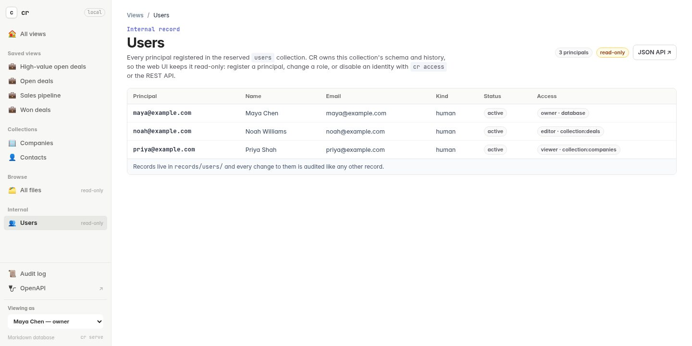

# Control record access

Access control is opt-in. Existing databases stay in legacy open mode until the
current CLI identity initializes the reserved, fixed-schema `users` collection:

```sh
export CR_NAME='Jane Doe'
export CR_EMAIL='jane@example.com'
cr access init
```

For an unattended deployment, initialize the first owner as software instead:

```sh
cr access init --service --name Harness --email harness@example.com
```

`--kind human|service` is the explicit form; `--service` is the convenient
service shorthand.

## Manage users

The first user becomes the database owner. Its record is ordinary readable
Markdown at `records/users/jane@example.com.md`, but its schema and mutation
surface are owned by CR: generic `create`, `save`, and `delete` commands cannot
change `users`, and generic `update` is restricted to the safe fields described
below. Use the dedicated commands for lifecycle and policy changes:

```sh
cr user add maria@example.com --name Maria --email maria@example.com --set role=CEO
cr user ensure nightly@example.com --name Nightly --service --set queue=default
cr user update maria@example.com --name 'Maria Garcia' --set team=leadership
cr user delete nightly@example.com --yes --if-unused
cr access grant maria@example.com editor collection:deals
cr access grant assistant@example.com editor collection:users
cr update users maria@example.com --set profile.last_seen=2026-09-02
cr access grant maria@example.com viewer record:deals/sensitive-renewal
cr access check update record:deals/acme-renewal
cr access revoke maria@example.com record:deals/sensitive-renewal
```

`email`, `kind`, `status`, and `access` remain CR-owned and validated. A user's
`name` remains validated and owner-managed for other users, while an active
principal may change its own name without a grant. Application identity data
belongs under the open `profile` namespace; each `user --set` applies a dotted
path within that namespace. An `editor` grant on `collection:users` lets an
integration update `profile.*` through ordinary `update` and REST `PATCH`
operations, but does not open any managed field. Active principals may update
their own `profile.*` without a grant. This is enough for many integrations to
use `users` as their principal and people registry without adding a parallel
table, while applications that also model people who can never act may still
keep those records separately.

`user ensure` is the declarative, race-safe bootstrap command: it creates a
missing principal, exits successfully without writing another event when the
complete definition already matches, and returns a `conflict` if the existing
definition differs. `user update` changes identity and profile fields under the
audit lock while preserving access grants and the stable ID. If somebody edits
a managed user Markdown file directly, `user restore ID` reproduces its exact
latest audited state so `audit verify` can become clean again. Only an audited
database owner may restore policy files.

`user delete ID --yes` is also owner-only. It removes the materialized user and
its grants, while the ordinary audited delete event retains the complete prior
state as the ID's tombstone. The final active database owner cannot be deleted.
`--if-unused` adds a conservative cleanup guard: CR scans the complete verified
chain and refuses if that identity was an effective actor or recorded
impersonator anywhere except its own `users/ID` lifecycle. Omitting the flag is
the explicit way to delete a historically used, non-final principal.

A tombstoned user ID is not an ordinary missing ID. `user add` and `user ensure`
refuse to reuse it unless an owner passes `--reuse-deleted-id`, because reuse
joins both real-world identities under one permanent audit history. The fresh
user starts active with no grants; historical grants in its deleted state are
not restored. A direct `record:users/ID` grant held by another user is ignored
while the target is absent. Explicit reuse makes that record resource exist
again, so revoke such incoming grants first when the replacement is a different
person. Historical event actor strings and access decisions remain valid audit
evidence after deletion and continue to verify without a live user record.

## Resources and roles

Resources are written as `database`, `collection:NAME`, or
`record:COLLECTION/ID`. Database grants inherit into every collection and
record; collection grants inherit into their records; and a direct record
grant replaces the broader role for that record. Database ownership is never
accidentally narrowed by a more specific grant. Record-owned collections are
the explicit exception to collection inheritance described below.

| Role | Effective capability |
| --- | --- |
| `viewer` | Discover and read records and their permitted audit history. |
| `editor` | Viewer access plus create, update, and link. Deletion is deliberately excluded. |
| `access_manager` | List users and grant or revoke ordinary roles, without receiving record contents. |
| `owner` | Every operation, including deletion, ownership, integrity checks, and access administration. |



## Keep private and shared records in one collection

An empty collection can opt into creator-owned records instead of inheriting
its collection role into every existing record:

```sh
cr access policy set collection:secrets \
  --mode record-owned \
  --default-visibility private
cr access grant maria@example.com editor collection:secrets
```

Every `cr create secrets ...`—including creates through the REST API, web UI,
and sync runner—then atomically records the effective principal as that
record's owner. New records are private. The collection `editor` role permits
discovery and creation, but does not make another creator's existing records
readable or editable. The record owner, an applicable direct record grant, and
an inherited `owner` grant remain valid. Database and collection owners retain
administrative access.

The owner can expose one record to every active registered principal, make it
private again, or transfer it to another active principal:

```sh
cr access visibility secrets deployment-token shared
cr access visibility secrets deployment-token private
cr access owner secrets deployment-token lee@example.com
```

`shared` adds read-only access for the active-principal audience; it does not
grant updates, deletion, or access management. Use an ordinary direct record
grant when one additional principal needs a stronger or private role:

```sh
cr access grant lee@example.com editor record:secrets/deployment-token
```

CR stores the owner and visibility in reserved `$cr_access` front matter. The
field is deliberately plaintext policy metadata, never secret material, and
generic create/update/patch/save operations cannot forge or change it. Its
changes are ordinary record audit diffs; allowed mutations also carry a
`resource_policy_hash` beside the existing user `policy_hash`. All CLI, raw
field, REST, search, relation, view, and audit reads pass through the same
decision. Deleting and recreating an ID creates a new owner boundary.

Activation is limited to an empty collection with no audit history. This keeps
the first record atomic and fail-closed instead of temporarily assigning an
owner to existing data. To consolidate older private/shared collections,
enable the policy on a new collection and import each record through CR while
acting as its intended owner; mark only the company-wide records `shared`.

## How decisions are recorded

User records carry their direct `access` grants, so every policy change is a
normal versioned audit event. A permitted record mutation stores the principal,
effective role, grant scope, decision basis, and hash of the user policy that
allowed it. The basis is normally a stored grant; a self name/profile update is
marked `self_service` explicitly.
`cr access check ACTION RESOURCE` explains the stored resource-level decision
without writing. The additional `users` field boundary is evaluated when a
concrete mutation supplies its fields; a self-service mutation records that
separate basis in its event.

## Act on behalf of another principal

The principal and audit actor are normally one user-facing identity. Once RBAC
is enabled, `--actor` may repeat that principal but cannot impersonate another
one. A trusted process launched as a database owner can explicitly delegate a
command to a registered principal instead:

```sh
cr --as maria@example.com update deals acme-renewal --set stage=won
```

The command is authorized as Maria, not as the owner. An allowed mutation
records Maria as its actor and principal plus the launching owner under
`access.impersonated_by`. The local `cr serve` perspective console uses this
same boundary when an owner selects a registered user in the top-right
switcher, so its HTML and REST requests are evaluated as that user too. Both
the launching owner's policy and the target policy must match their latest
audited versions before delegation is accepted. `--as` is rejected for
`serve`: one delegated command must not silently become a long-lived identity
boundary.

## What access control does not protect against

The local identity is still an assertion supplied by the process, so this is
strong CR gating, not a sandbox: somebody who can read or edit the backing
Markdown can bypass CR. The RBAC perspective console therefore requires an
owner to launch it and refuses non-loopback binds. It is an administrative
preview, not a per-user login system. A future managed mode can make
enforcement non-bypassable by keeping the backing directory private and
authenticating CLI clients through a daemon or server.
