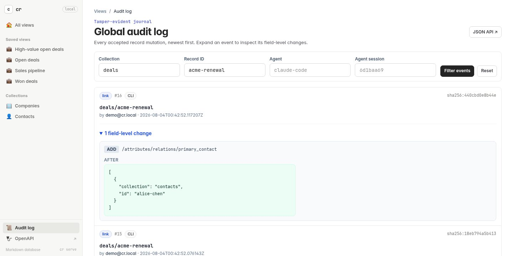

# Audit history and integrity

Every successful `create`, `update`, `link`, `delete`, direct `save`, and changed sync upsert/delete writes an attributed event.



## View history

Show recent events for the entire database:

```sh
cr audit log
cr audit log --limit 100 --json
```

With RBAC enabled, owners see the complete global stream. Other principals see
only events for records whose audit history they may currently read, plus their
own user-policy history; visibility is applied before `--limit`. This makes an
editor's `audit log` useful without granting database-wide access management.

Show history for one record:

```sh
cr audit log candidates alex-smith --limit 20
```

## Verify the journal

Verify the journal and all current records:

```sh
cr audit verify
```

Verification does more than check the event hash chain. It replays every
record's change sets, checks each `before_hash`, and requires every replayed
post-state to reproduce that event's exact `after_hash`. Version 3 audit events
carry a versioned exact-Markdown `after_snapshot` for every state in which the
record exists. This keeps YAML comments, quoting, key order, and line endings
honest without making verification depend on a serializer's current output.
Old version 1 and 2 events remain readable: when their lost representation
details matter at a record's current head, the matching materialized record is
used as the exact witness. Payload versions may increase but never decrease
within a journal. Every new mutation performs the same replay before it writes,
so an inconsistent older event refuses the write at the guilty sequence with
`audit_integrity_failed`.

Print the current audit checkpoint:

```sh
cr audit head --json
```

The audit journal is tamper-evident, not magically tamper-proof if an attacker can rewrite both the database and its entire local history. Store important checkpoints outside the database—for example in a signed Git commit or trusted remote service—and verify them later:

```sh
cr audit verify --expected-head 'sha256:YOUR_SAVED_HASH'
```

[Sign checkpoints](#sign-checkpoints) makes that automatic: every write
signs the new head with a key kept outside the database, and a verifier
holding only the public key checks it.

### Reads, writes, and the saved walk

Commands other than `audit verify` and `check` need the journal too: reading
or listing a collection without encryption checks that no record once owned
encrypted storage, `--as` checks the operator's and the target's audited
policy, and every write checks the record it changes. Replaying every event for
each of those would make every command slower with every change ever recorded.

So each command that appends an event saves its verified walk of the journal in
`.cr/cache/verified-journal.json`, and the next command resumes from it,
verifying only the events appended since. Whether an older segment still is
what was verified is judged from its file identity, size, and modification and
change times; the newest segment is compared with the digest of what was
verified. Anything that does not match, and a missing, damaged, or
other-release file, sends the command back to the first event. Reads never
write the file, and `.cr/cache/` can be deleted at any time.

Writes resume it too. A write verifies the events appended since the saved
walk while it holds the audit lock, and when it appends, it checks that the
journal on disk is still what it verified — older segments by their file
identity, size, and times and the newest byte for byte — rather than walking it
again. Once 64 events have been appended since a write last verified every
event from the first, the next write does that instead, so one write in 64 pays
for a full walk and the rest pay for the events since. Change the interval in
`.cr/config.yaml`; `1` makes every write walk from the first event:

```yaml
audit:
  full_walk_after_events: 1
```

Nothing that verifies the journal uses the saved walk: `audit verify` and
`check` start from the first event every time. To have any other command, write
or read, start from the first event too, pass the global `--verify-audit`:

```sh
cr --verify-audit get deals acme-renewal
```

The saved walk is as writable as the journal. Someone who can rewrite `.cr/`
can make a command believe a different replayed state, and a write build on
it, until the next write that walks from the first event. That write, like
`audit verify`, then refuses the journal at the first event that was built on
the forgery. The saved walk does not hide an altered segment, short of a
rewrite that also restores the segment's change time
([the trade](architecture.md#the-verified-journal) the server has always made).

## Anchor the head in Git

Every audit event but the newest is pinned by the hash recorded in the event
after it. The newest one is pinned by nothing. Replay now catches a rewritten
result whose change set no longer reproduces `after_hash`, but it cannot derive
an event's actor, timestamp, message, or attribution from record state. Those
fields can still be rewritten and re-hashed without an external checkpoint.
The fix for that remaining boundary has always been to keep a copy of the head
hash somewhere the forger cannot reach — and the reason it did not help is that
saving one by hand is a step nobody performs.

`cr` now keeps that copy for you, in `.cr-audit-head.json` at the root of the database:

```json
{
  "version": 1,
  "sequence": 42,
  "hash": "sha256:9f2c…",
  "timestamp": "2026-03-04T11:22:33Z"
}
```

Every command that records an audit event rewrites it, and `cr audit verify` checks it with no arguments. Inspect or repair it directly:

```sh
cr audit anchor           # show the recorded anchor
cr audit anchor --json
cr audit anchor --write   # (re)write it to the current head
```

**Commit it, or it is worth nothing.** This file sits at the database root, so
anybody who can rewrite `.cr/audit/` can rewrite it in the same pass — alter
non-state metadata, recompute the hash, update the anchor, and verification goes
quiet again. Its protection comes entirely from the copy in your **Git
history**: a pushed, distributed history is a second place to write that a
local process cannot reach. So keep the database in version control and commit
the anchor alongside the records it attests:

```sh
git add records .cr-audit-head.json
git commit -m 'Move alex-smith to offer'
```

The only `.gitignore` `cr` writes is inside `.cr/cache/`, and it ignores nothing but that directory. The anchor must never be excluded by one.

When you review a commit, the anchor tells you two useful things. The hash should change in exactly the commits that also change records or `.cr/audit/`, and the sequence should only ever go **up**. An anchor that moved on its own, went backwards, or jumped is worth stopping on.

If `cr audit verify` reports a mismatch, it means the journal on disk is not the journal your anchor attests to. Compare the anchor in your working copy against the last one in `git log -p -- .cr-audit-head.json`, and against what a colleague or your server has. Whichever side moved without a commit to explain it is the side to distrust.

A **behind** notice is different, and says so:

```text
Verified 12 audit events and 4 records; head sha256:6b1a…
notice: the audit anchor is behind at sequence 9 of 12; the journal still agrees with it, so this is a lagging anchor rather than altered history
```

That is not tampering. The journal still contains exactly the event the anchor names, at the sequence it names — it has simply grown past it, which is what a crash between writing the event and writing the anchor leaves behind. Events after the anchored sequence are unpinned until you catch up, so run `cr audit anchor --write` and commit. `cr check` reports the same thing as a warning, and reports a real mismatch as an error.

A database created before this feature has no anchor at all. It keeps working and says so; adopt it with one command and a commit:

```sh
cr audit anchor --write && git add .cr-audit-head.json
```

To put the head in the commit itself as well, including commits in a repository
that does not hold the database, add a `Cr-Audit-Head:` trailer with the
example `commit-msg` hook. [Commit as the agent, on the human's
behalf](agents.md#commit-as-the-agent-on-the-humans-behalf) describes it with
the rest of the Git convention for agent-made commits.

## Sign checkpoints

The anchor is worth what your Git history is worth. Someone who can rewrite
`.cr/audit/` can rewrite the newest event's actor or message, recompute its
hash, re-derive `.cr-audit-head.json` to match, and `cr audit verify` goes
quiet. A signed checkpoint is the same statement as the anchor, made with an
Ed25519 key that never enters the database, and checked against a public key
that comes from outside it too. Rewriting every file under the database root
does not produce a signature, so that forgery fails.

### Create a key

```sh
cr audit key generate ~/.config/cr/audit-signing.key
# Wrote a private audit signing key to /home/you/.config/cr/audit-signing.key; keep it outside the database and point CR_AUDIT_SIGNING_KEY at it where writes should be signed
# Key ID: sha256:58e7e510…
# Public key, for --trusted-key and CR_AUDIT_TRUSTED_KEYS:
# ed25519:wJ_mDPbr-ScbnvgC2v5ufoxJabn94Z892fBDmyGt7gk
```

The private key is created readable and writable by you alone (mode `0600` on
Unix) and is never overwritten: generating onto an existing file fails. `cr`
warns if the path is inside a database, because a key stored in the tree it
signs can be read by exactly the person the signature exists to stop. The
public key is not secret; `cr audit key show` prints it again later, from a
path or from `CR_AUDIT_SIGNING_KEY`, and `--json` gives both commands'
output as an object.

### Sign every write

Point `CR_AUDIT_SIGNING_KEY` at the key and sign the current head once:

```sh
export CR_AUDIT_SIGNING_KEY=~/.config/cr/audit-signing.key
cr audit anchor --write
# Anchored and signed sequence 42 at sha256:9f2c… with key sha256:58e7…; commit .cr-audit-head.json and .cr-audit-head.sig.json
git add .cr-audit-head.json .cr-audit-head.sig.json
git commit -m 'Sign the audit head'
```

From then on every command that records an event — `create`, `update`,
`link`, `unlink`, `delete`, `save`, `sync`, `audit baseline`, and a `cr serve`
launched with the variable set — writes `.cr-audit-head.sig.json` right after
the anchor. A database whose first write is made with the key set is signed
from its first event without that first step.

```json
{
  "version": 1,
  "database": "sha256:e722b7c3…",
  "sequence": 42,
  "hash": "sha256:9f2c…",
  "timestamp": "2026-03-04T11:22:33.123456789Z",
  "key_id": "sha256:58e7e510…",
  "signature": "ed25519:DIGM_NE_…"
}
```

`sequence`, `hash`, and `timestamp` are the anchor's. `database` is the hash of
the journal's first event, which names the database: a checkpoint copied from
another database, even one signed with the same key, is refused as made for a
different database. Like the anchor, the file is a pure function of the
journal and the key, since Ed25519 signatures are deterministic. Commit it with
the anchor.

### Verify against a trusted key

```sh
cr audit verify --trusted-key ed25519:wJ_mDPbr-ScbnvgC2v5ufoxJabn94Z892fBDmyGt7gk
# Verified 42 audit events and 17 records; head sha256:9f2c…
# Verified the signed checkpoint at sequence 42 under trusted key sha256:58e7e510…
```

`--trusted-key` takes a public key or the path of a file with one key per line,
where blank lines and `#` comments are skipped and anything after the key is a
label. Repeat it to trust several keys; any one of them may have signed. With no
flag, `CR_AUDIT_TRUSTED_KEYS` holds the same values separated by commas, which
is the natural setting for CI. `cr check --trusted-key` judges the checkpoint as
well, and `GET /api/v1/audit/verify` and `GET /api/v1/check` take repeatable
`trusted_key` parameters.

With a trusted key, verification fails with `signature_mismatch` when there is
no signed checkpoint, when it was made with a key you did not name, when it has
been edited and no longer verifies, when it was made for a different database,
and when the journal no longer holds the event it signed — the forged head
above. Without a trusted key nothing about the signature is judged, and
`verify` only notes that a checkpoint is present.

**Trust only keys from outside the database.** A trusted-keys file committed
inside the database proves nothing against someone who can rewrite the
database: they replace the key and sign with their own. `cr` warns when a key
file you name is inside the database it verifies. Keep the public key in CI
configuration, a separate repository, or anywhere the database's writers
cannot change.

### Lagging signatures

A crash between the anchor write and the signature write, or a write by
somebody who does not hold the key, leaves the checkpoint behind the head:

```text
notice: the signed audit checkpoint is behind at sequence 40 of 42; key sha256:58e7… signed it and the journal still agrees with it, so this is a lagging signature rather than altered history, and later events are not signed yet
```

That is not tampering, for the reason a lagging anchor is not. Everything up
to sequence 40 is still pinned by the signature, and the events after it are
not signed yet. `cr check` reports it as an `audit_signature_behind` warning.
The key holder's next write signs the head again, and so does
`cr audit anchor --write`. That makes a key held only by CI a workable setup:
people write without it, and a job with the key re-signs after each merge.

### What a signing write refuses

A write with the key extends a signed history; it never starts one over a
history it has not verified. It signs only when the stored checkpoint verifies
under a key it trusts — its own, and any in `CR_AUDIT_TRUSTED_KEYS` — and the
journal still agrees with it. So:

- when a trusted checkpoint disagrees with the journal, the write is refused
  with `signature_mismatch` before anything is written, rather than signing
  on top of a forgery;
- when there is no checkpoint, or one under a key it does not trust, the write
  goes ahead and signs nothing. Adopting signing is the explicit
  `cr audit anchor --write`. Before running it on a database that was signed
  before, look at `git log -p -- .cr-audit-head.sig.json`: a checkpoint that
  vanished is one somebody removed.

When several people sign with their own keys, each lists the others' public
keys in `CR_AUDIT_TRUSTED_KEYS`. To rotate a key, set `CR_AUDIT_SIGNING_KEY` to
the new key and `CR_AUDIT_TRUSTED_KEYS` to the old public key, run
`cr audit anchor --write` so the old checkpoint is verified before the new key
signs, commit, and give verifiers the new public key.

### What a signature does not prove

- **Freshness.** Someone who kept an older signed checkpoint can cut the
  journal back to it and restore that file, and it verifies. The sequence
  going down in the Git history of `.cr-audit-head.sig.json` is what shows
  it, as does comparing with `--expected-head`. Trusted timestamps and
  transparency logs, which would, are not implemented yet.
- **Events past the signed position.** A lagging checkpoint pins nothing after
  its sequence, and the key holder's next write signs over whatever was
  appended in between without judging who wrote it.
- **Which of several databases.** A key that signs several databases verifies
  any of them, so replacing one wholesale with a copy of another is not a
  signature failure. Use a key per database, or compare the `database` field
  with the first event you expect.

## Baseline existing records

For records that existed before audit logging was introduced, establish their starting state once:

```sh
cr --actor 'migration@example.com' audit baseline
```

## What the journal retains

Audit events retain historical field values and deleted record bodies, and now
also any recorded intent text. Every version 3 event with a present record
retains the complete exact post-state in `after_snapshot`, not only the changed
fields. Everything written to the journal is permanent: removing it would break
verification for that event and every event after it. Protect `.cr/audit/` at
least as carefully as `records/`, particularly for personal CRM and recruiting
data, and treat
`--intent-request` and `--intent-rationale` as a bounded attribution channel
rather than a place to paste a transcript.

## Check the whole database

`cr status` tells you what has changed since the last save. `cr check` tells you whether the database is *coherent* — and, unlike every other integrity command, it reports everything it finds instead of stopping at the first problem:

```sh
cr check
# error   dangling_link           record deals/acme-renewal has a relation 'company' pointing at companies/acme, which does not exist
# error   schema_violation        record deals/globex-expansion does not match the schema for collection 'deals': "stage" is a required property
# warning record_content_mismatch record companies/globex does not match its latest audited state; 'cr status' reports it as modified and 'cr save' records the change
# Checked 2 collections: 4 records on disk, 4 audited records.
# 2 errors, 1 warning.
```

It reports:

- **dangling links** — a relation pointing at a record that no longer exists;
- **malformed relation values** — a `relations` entry that is not a `{ collection, id }` reference at all;
- **schema failures** — records that no longer satisfy their collection's JSON Schema, which is what happens whenever a schema changes after its records were written, plus schema files that are themselves unusable. `users` records are judged against the built-in users schema;
- **invalid access metadata** — a record in a record-owned collection whose `$cr_access` value is missing or malformed, which every write refuses;
- **invalid record names** — files and directories that cannot be a record ID or a collection. Every other command refuses such a database outright, so this is the one finding `check` exists to be able to report: it names the offending filename and keeps scanning the records around it;
- **unreadable records** — Markdown that cannot be parsed, and anything behind a symbolic link;
- **audit reconciliation problems** — records with no audit history, audited records whose file has gone, files whose content does not match the audited state, a journal whose chain cannot be replayed, and a stored change set that does not match the approval recorded beside it;
- **interrupted sync runs** — a `cr sync run` that stopped partway, leaving part of an import applied and its checkpoint behind;
- **audit anchor problems** — a `.cr-audit-head.json` that does not agree with the journal (an error), one that lags behind it (a warning), and a journal with events that nothing anchors at all (a warning);
- **signed checkpoint problems**, only when you pass `--trusted-key` or set `CR_AUDIT_TRUSTED_KEYS` — a `.cr-audit-head.sig.json` that does not verify under the trusted keys or does not agree with the journal (`audit_signature_mismatch`, an error), one that lags behind it (`audit_signature_behind`, a warning), and no signed checkpoint at all (`audit_signature_missing`, an error, since naming a key says the database is signed).

Every finding names a record as `collection/id`, or a sync by name. A file that cannot be a record is named by its filename inside its collection, because that is the only way to say which file to remove. None of them ever prints a filesystem path.

The interrupted-sync finding is worth calling out, because nothing else surfaces it. The records a stopped run did commit agree with the journal, so `cr status` reports `Clean` and `cr audit verify` passes; without `cr check` you would only find out by running `cr sync recover <name> --check` on a sync you already suspected, or by being refused the next time you ran it. `check` reports it as a warning and tells you the command to inspect it with — it never recovers anything itself.

### `check` versus `status`

They answer different questions, and `check` does not repeat `status`'s answer.

- `cr status` is the working tree: *what would `cr save` record next?* Every line it prints is a normal, resolvable direct edit.
- `cr check` is integrity: *is this database coherent?* When a divergence from the journal is one `cr save` can reconcile, `check` reports it as a **warning** and points you back at `status`. When the same record also fails to parse or fails its schema, `save` will refuse it, so `check` raises it to an **error** — that record is stuck, and `check` is the only command that says why.
- Some edits `save` refuses wherever they are made: any direct edit to `users`, and creating, deleting, or changing the `$cr_access` of a record in a record-owned collection by hand. `check` reports those as **errors** too, and names the command to use instead — `cr user restore`, `cr create`, `cr delete`, or `cr access`.

Everything else `check` reports — dangling links, malformed relations, schema drift, invalid names, journal damage — is invisible to `status`.

### Exit status, scope, and output

```sh
cr check                              # whole database
cr check --collection deals           # one collection; links, journal and syncs are still checked
cr check --json                       # the complete report, including the summary
cr check --fail-on warning            # unsaved direct edits fail too
cr check --fail-on never              # report without ever failing
cr check --trusted-key ed25519:…      # judge the signed checkpoint too
```

| Exit | Meaning |
| ---- | ------- |
| `0`  | Ran successfully; nothing reached the failure threshold. |
| `2`  | Ran successfully; found problems at or above the threshold. |
| `1`  | Could not run at all — no database, an unknown `--collection`, unreadable configuration. |

A command line `cr` cannot parse, such as one with a misspelled option, exits `2` as well, as it does for every command. It prints no findings, and under `--json-errors` its stderr carries the `usage_error` code. A `--fail-on` value that is not a threshold is `1`, like an unknown `--collection`.

That split is the point in CI and cron: a typo in a scheduled job must never look like a clean bill of health. The default threshold is `error`, so an ordinary unsaved edit does not fail the build.

`check` never writes. It cannot repair anything, and there is no `--fix`: a dangling link might want the relation removed, the target restored, or a delete policy applied, and only you know which.

It reads and parses every record in scope and replays the journal, so it costs about what `cr search` over the whole database costs, and it holds the write lock while it runs. Use `--collection` on a large database.
