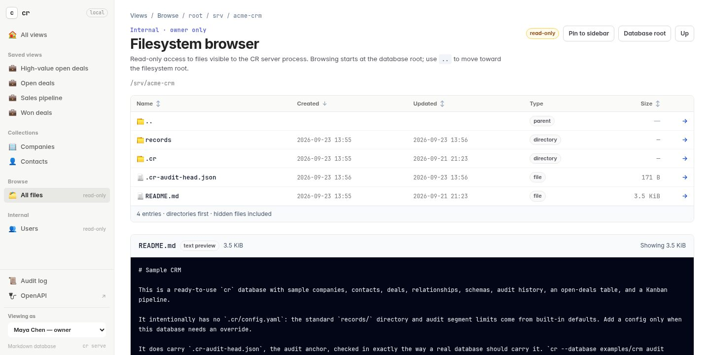

# Web UI

`cr serve` renders every collection as a searchable, filterable table, with
saved views, Kanban boards, schema-driven forms, and the audit journal beside
them. The same server answers the [REST API](http-api.md).


## Start the server

Start the web UI and REST API from inside a database:

```sh
cr serve
```

The default address is `127.0.0.1:3000`, so the server is only reachable from the local machine:

```text
Serving cr on http://127.0.0.1:3000
Views: http://127.0.0.1:3000/
Audit: http://127.0.0.1:3000/audit
OpenAPI: http://127.0.0.1:3000/openapi.json
```

Use another address or port when needed:

```sh
cr serve --bind 127.0.0.1:8080
```

For an RBAC-enabled database, launch `cr serve` as a database owner. The header
then includes a **Perspective** switcher containing every registered user. Its
session cookie applies the selected principal to both HTML pages and REST API
requests: collections and records are filtered, record pages become read-only
for viewers, create/edit/delete controls follow the effective role, and Kanban
movement is enabled per record. Disabled users can also be selected to inspect
their no-access state. Switching perspective does not mutate policy.

This console is intentionally administrative and loopback-only. It does not
authenticate different browser users. If the selected perspective performs an
allowed mutation, the audit event names that user as actor and records the
launching owner under `access.impersonated_by`.

The HTTP layer calls the same Rust database methods as the CLI. It does not spawn a `cr` subprocess. Schema validation, atomic writes, audit locking, direct-edit reconciliation, and tamper checks therefore behave the same way in both interfaces. HTTP mutations are recorded with `source: api`.

One thing differs, and it is what keeps pages fast on a database with a long history. A CLI command resumes the verified walk of the audit chain that the last write saved and verifies only what was appended since. The server does the same as soon as it is listening, and after that keeps the walk in memory, so a page costs about the same on the ten-thousandth event as on the tenth. The newest segment is still compared with what was verified on every read. An older segment is trusted while its file identity, size, and modification and change times are unchanged. A rewrite that also restores the change time, which takes resetting the clock or writing the disk directly, is only noticed by the next walk from the first event. `cr audit verify` and `cr check` and their API routes still verify the whole chain, a write does so once every `audit.full_walk_after_events` events, and `cr --verify-audit serve` starts the server, and every write it makes, from the first event. [`architecture.md`](architecture.md#the-verified-journal) has the details.

To require a bearer token, see
[Authentication and identity](http-api.md#authentication-and-identity).

## Browse automatic views


Open [http://127.0.0.1:3000/](http://127.0.0.1:3000/) to see every collection. Each collection gets a useful table without configuration, so a `deals` collection is immediately available at:

```text
http://127.0.0.1:3000/deals
```

The index lists saved views, then collections, one line each: the name, how
many records the view shows, when the most recently changed of them last
changed, and whether it is automatic, saved, or Kanban along with any saved
filters. A saved view's count is the records it matches, not the size of its
collection, and every count is what the current perspective may read—a viewer
granted one record sees `1`, however many the collection holds. A collection
that cannot be read, or a journal that does not verify, leaves a dash in place
of its numbers rather than an error page; opening the view reports why.

Counting reads every record, so the numbers arrive just after the rows: the
index names every view at once, then fills in the counts, the last changes,
and the total in the heading with one more request. With JavaScript off, a
**Count records** link opens the same index with the numbers already in it, at
`/?summary=inline`.

A collection is called by its directory name in sentence case, so
`inbound-ratings` reads **Inbound ratings**, and is marked 🗃️ in the index. Give it a better name or its own emoji with
[`cr schema label` and `cr schema icon`](#name-collections-and-give-them-icons).

The default UI uses a compact workspace shell rather than a documentation-style
page frame. On desktop, a persistent sidebar holds **All views**, then your
saved views, then internal records, with audit, OpenAPI, and the RBAC
perspective control anchored below. Collections are not listed in it: they are
on the **All views** index, under their own **Collections** heading after the
saved views, and **All views** stays highlighted while you are on a
collection's page or one of its records, as the breadcrumb says. Saving a view
is how a collection, or a filtered, sorted, or Kanban way of reading one, gets
a place in the sidebar; until there is one, the section says so to anyone who
may save views. Once the list is longer than the window it
scrolls between the brand and that anchored section, which stay put, and a
fade above the section and under the brand shows while entries are hidden
beyond either edge, where the browser supports scroll-driven animations. The
list keeps its scroll position from page to page, so an entry clicked far down
stays under the pointer, and a page whose own entry would be out of sight, such
as one opened from a link, scrolls the list to show it; the narrow-screen strip
does the same sideways. Every entry is marked by an emoji—a collection's own when its schema names one—and
each section is ordered by the name a reader sees;
the active route remains highlighted on list, board, and record pages. Narrow
screens collapse the same hierarchy into a sticky top bar and horizontally
scrollable view strip.

Every page opens with one bar across the top of the workspace, in the manner
of Linear and GitHub, so records begin near the top of the window. The bar
holds a breadcrumb that ends in the page's title, at the size of the text
around it — **Views › Deals** — then a quiet word about what the page holds,
and the page's controls on the right, every one of them the same 32-pixel
height. On a view that word is its record count, which follows every search
and filter, and a saved view adds the collection it reads (**Saved view of
`deals` · 3 records**) and lists its own filters under the bar. A record's bar
reads **Views › Deals › Acme renewal** with the record ID after it, and a page
that needs something said before it is used, such as the read-only Users page,
says it in one line under the bar. On a desktop the bar stays at the top while
the page scrolls. On a phone it keeps only the nearest step back, since the
view strip reaches the rest, and puts the count on a line of its own.

Every table opens with two columns the database derives rather than stores:
**Created** and **Updated**, read from the audit journal and shown right after
the record's [title](#use-schema-driven-record-forms) or ID. Nothing in front
matter records a record's age, and a field that claimed to would be a second
copy a direct edit could contradict, so the journal stays the only source. A record written directly and not yet saved has no
audited age and shows `—`. Both columns sort like any other, and both follow
audit-read permission: a principal sees a timestamp exactly where `cr audit log`
would show it the event.

Views are ordered newest first by default — `$created_at` descending — so the
first page answers "what changed?" before it answers "what exists?". While a
table is ordered by **Created** or **Updated**, in either direction, its rows
are grouped by day under headings — **Today**, **Yesterday**, a weekday within
the last week, then a date — so a page of records made hours apart does not
repeat "5 hours ago" down the column without saying where one day ends. Days
are the reader's own: the browser groups the rows in its time zone, since the
server knows each instant but not where the reader's midnight falls. Records
with no audited history come last under **No history**. Without JavaScript the
table is not grouped. A view
definition's own `sort_by` still wins, and any column heading or the sorting
panel overrides both for the current URL.

The search box above the table searches each record's whole Markdown file,
front matter and body; its magnifier, at the start of the box, submits it.

The table infers other columns from the collection schema and current front
matter. A saved view's own columns come first. The rest follow the schema's
`x-cr-ui.order`, the order the record form uses, then its `required` fields in
the order it lists them, then every other field by where it sits in the front
matter of the records that have it, averaged over those records so one file
written in an unusual order does not move a column. Fields only the schema
declares come last, and the name breaks ties. A view without columns of its own
shows the first six of them, passing over the title field, which is already the
first column, and any field whose values are objects or lists of objects, which
a one-line cell can only print as a run of `key: value` pairs. Every field
except the title stays in the column picker. Its dense header keeps search and its submit action immediately
available.
**Filter** opens the complete schema-aware condition, column, and sorting panel
only when needed, and shows the number of active ad hoc conditions. Rows use the
entire available workspace and keep the stable ID, every selected value, and a
small open action visible without a separate oversized action column. A long
record ID, such as a slug followed by a hash, is capped at a fixed width so it
cannot push the other columns off screen: its start and its last ten characters
stay visible with an ellipsis between them, and hovering shows the whole ID.
Every row is one line: a value too long for its column, which is at most 20rem
wide, ends in an ellipsis, and hovering a value of 40 characters or more shows
all of it, with a nested value on its own lines. The table scrolls inside its own box, sized to the window, so the heading row
stays in view as rows scroll past and the horizontal scrollbar stays on screen.
The open action stays at the right edge, and on screens at least 900 pixels
wide the record ID stays at the left edge, so a row scrolled sideways still
says which record it is. In browsers that support scroll-driven animations, a
fade before the open action shows that more columns are hidden to the right,
and a shadow after the ID shows that columns have scrolled under it. The
view also includes cursor pagination, create and edit forms, and audited deletion.
Click anywhere on a row to open its record. The row's one link is its title or ID in the first cell, which is what the keyboard and a browser without JavaScript use, together with the open action at the row's end; the cells between are text, so tabbing through a table stops twice per row rather than at every cell. A click that ends a text selection is left alone so a value can still be copied, and a Ctrl-, Cmd-, Shift-, or middle-click opens the record in a new tab.
Saved views can switch the same query to a Kanban layout. Every mutation is
schema-validated and recorded with `source: api`.

The conditions a URL applies are listed above the results as chips, in the
filter panel's words — **Status is Failed**, **Assignee is empty** — after
**Filtered by**, or **Any of** when any condition may match. Each chip's **×**
removes its condition and keeps the search, the sort, and the rest, and with
more than one, **Clear filters** removes them all. A saved view's own filters
are not chips, because they are what the view is; the heading lists them.

Above a table, a row of quick filters splits the view by state in one click.
It is on the collection's `status` or `state` field when it has one of plain
text or an enum, or else on its first enum field in column order, and it is
left out when the field has only one value, when that field is the title, and
on Kanban boards, whose lanes already do this. **All** comes first, then up to
eight values — an enum's in the schema's order, anything else most frequent
first — then **Not set** for records without one. Each chip says how many
records it would show: the count honours the search and every other filter in
the URL, but not the conditions on its own field, because clicking a chip
replaces those with its own (`is` the value, or `is empty` for **Not set**).
Each chip is a link to the same URL the filter panel would build, so the panel
shows the condition when opened. With **any** matching and a condition on
another field, a chip would widen the result rather than narrow it, so the row
is left out.

The filter builder combines up to 20 conditions with either **all** (AND) or **any** (OR) matching. Each condition reads as a sentence — **Where** Stage is Proposal, **and** Value is at least 10000 — and a new one is just **Where** and a field to choose; its comparison and value appear once the field is chosen. **Match All / Any** appears beside the heading once there are two conditions, and switching it turns each **and** into **or**. Each row has schema-aware operators: equality and inequality for every type; numeric and ISO string/date comparisons; string and array containment; starts/ends-with; and explicit empty/not-empty checks, which take no value. Enum, boolean, and multi-select values use constrained dropdowns, numeric fields use numeric inputs, formatted strings use their matching input type, and other values are read as YAML, so `10` is a number and `"10"` is text. **+ Add filter** adds a row, or goes to the row still waiting for a field, and **×** removes one. Below the conditions, **Sort** picks a field and a direction, and **Columns** is folded until opened. **Apply** keeps the panel open over the new results, **Reset** returns the view to its defaults, and a click outside the panel or Escape closes it without losing what was typed. The rows lay out by the panel's own width, so on a narrow screen each comparison moves under its field. The match mode and filters stay in the URL as `filter_match` plus repeated `filter_field`, `filter_operator`, and `filter_value` triples, including through pagination. Saved-view predicates always remain required, so choosing **any** cannot escape the view's underlying scope. Missing values match `is empty`, but do not silently match negative operators such as `is not` or `does not contain`.

Every generated page also has schema-aware sorting. Choose a field and direction in the query panel, or click a table column heading to toggle ascending and descending order. Numbers sort numerically, strings and normalized ISO dates sort lexicographically, missing values stay last in both directions, and record ID is the deterministic tie-breaker. The audit-derived `$created_at` and `$updated_at` sort by journal sequence rather than by formatted instant, so two events in the same second still order exactly as they happened, and records with no history stay last. Sorting happens before pagination and remains in pagination URLs; Kanban uses the same order for cards inside each lane.

Pages hold 25 rows unless a view or the URL's `limit` says otherwise. The footer offers 10, 25, 50, and 100 rows per page, leaving out any size above the server's `--max-page-size` and adding the current size if a view or URL chose another; each is a link to the first page at that size. Beside the range it states the page number, such as "Page 2 of 7". On a table with more than one page, **Previous** and **Next** both stay in place, the one that cannot be used drawn greyed out, and they are cursors rather than offsets. Each link names the record the next page continues after (`after=<id>`) or ends before (`before=<id>`), so creating a record while someone is paging does not push a row they have already seen onto the next page. The footer still reports an exact position and total, because the ordered result is assembled before the page is cut from it. A cursor naming a record that no longer matches — deleted, or filtered out by an edited query — starts again from the first page, and `offset` remains accepted so links shared before cursors existed still resolve.

Open **Columns** in the same panel to choose the visible table fields or Kanban card details. The selection is encoded as `columns=custom` plus repeated `column` parameters, so it survives sorting and pagination and can be shared as part of the URL. At least one of the fields available from the saved view, schema, or current records must remain selected. The record's title, or its ID when it has none, stays visible as the link in the first column, so neither is part of the field selection. Each field inside an object that holds a plain value, or a list of them, is offered too, right after its object: `learning.status` and `learning.session` beside `learning`. Such a column reads its value through the schema like any other, sorts by its dotted path, and appears in the filter builder with the control its schema definition calls for. Only one level is offered, and none is shown by default.

## Inspect internal records

CR's own `users` registry is not application data, so it is deliberately absent
from **Collections**. It is still worth seeing, so an RBAC-enabled server lists
it under **Internal** in the sidebar and in its own section of the view index:

```text
http://127.0.0.1:3000/users
```

The page shows every registered principal, its name, email, kind, status,
direct grants, and any application-owned profile fields. A principal's first
three grants are listed and the rest fold behind a `+N` that opens to show
them, so somebody granted a long run of single records keeps a one-line row.
Grants are sorted by resource, which puts collection and database grants before
record ones. It is strictly read-only: there is no create, edit, or delete
control anywhere on it, and the record routes that serve collection views never
reach `users`. Register a principal, change a role, or disable an identity with
`cr user` and `cr access` (see [Control record access](access-control.md)), or
through the REST API. Those paths enforce the reserved-field rules browser
forms cannot express.

The section only appears for a perspective that may read access policy—database
owners and access managers—and `/users` itself answers `403 Forbidden` to
anyone else. Without RBAC the page stays reachable but unlinked, and explains
that `cr access init` bootstraps the registry.

## Browse server files



Database owners also get a **Browse** section in the sidebar, after
**Collections** and before **Internal**. Its first entry, **All files**, opens:

```text
http://127.0.0.1:3000/browse
```

It is a fallback for inspecting, and when needed fixing, files that are not
CR records. The
first page is the canonical database root and lists every visible entry,
including dotfiles, with directories first. Like a view table, each entry shows
when it was **Created** and **Updated**—here the filesystem's birth and
modification times rather than the audit journal's, and `—` where a filesystem
does not record a birth time. Listings open newest-created first. Click
**Name**, **Created**, **Updated**, or **Size** to sort by it, and again to
reverse; directories stay above files, then links and the rest, whichever column
orders them, and a value the filesystem cannot give sorts last in both
directions. The order is in the URL as `sort_field` and `sort_direction` and
follows you into subdirectories; the default order adds nothing, so a pinned
location is still recognized. Open a directory to continue
browsing, open a regular file for an escaped text preview (or a hexadecimal
binary preview), and use the `..` row to move above the database until reaching
the filesystem root. Text previews wrap long lines, breaking even a URL or a
minified line with no spaces, while hex previews keep their aligned columns and
scroll instead. A directory that contains a README shows it beneath the listing,
the way a code host does, in the same bounded, escaped panel opening the file
gives; `README.md` wins over `README.markdown`, `README.txt`, and a bare
`README`, and names match without regard to case. An agent skill's `SKILL.md`
is shown the same way, after the README when a directory has both, since the
two are written for different readers. A document that cannot be read is
reported in place without hiding the listing. Both are shown as text rather
than rendered Markdown. Symbolic links are identified in listings and resolve to
their canonical target when opened. Devices, sockets, and named pipes are not
opened. Text previews stop after 1 MiB and binary previews after 4 KiB, so this
page is an inspector rather than a bulk-download endpoint.

The route is deliberately stricter than the users registry. It is only enabled
when RBAC is active, only a database-owner perspective sees its navigation
entry, and a direct request from an editor or access manager receives `403
Forbidden`. Without RBAC it is unlinked and returns `404 Not Found`, because a
local process with no principal registry cannot prove that a requester is an
administrator. Every response remains `no-store`. Browsing itself only reads;
pinning, editing, and deleting are separate `POST` routes behind the same
owner check and the form's CSRF token. There is no create, upload, or rename.

### Edit and delete files

Every file panel — an opened file, or a README or `SKILL.md` beneath a
listing — ends its header with a pencil and a trash can. The pencil turns the
preview into a textarea where it stands, with **Save** and **Cancel** in place
of the icons; with JavaScript off it opens the same editor as a page of its
own at `/browse/edit`. **Save** writes the file and returns to the page it was
edited on. Only a file whose preview is the whole file as text can be edited,
so a binary file or a text file over 1 MiB shows the pencil disabled, with the
reason on hover.

Saving is checked the way a record form is. The editor carries the SHA-256 of
the file it opened, and a file that has changed since — an agent, an editor,
another tab — is not overwritten: the save answers `412 Precondition Failed`
with the editor again, holding exactly what you typed. A browser sends every
line break in a textarea as CRLF, so a file written with line feeds keeps line
feeds and one written with CRLF keeps CRLF. The new contents are staged beside
the file with its permission bits and renamed over it, refusing a symbolic
link rather than following it. Leaving an editor with unsaved changes asks
first, as a record form does.

The trash can opens a confirmation page naming the file, its size, and its
directory; only that page carries the form, so nothing deletes a file on one
click. Deleting removes the file from disk rather than moving it to a trash,
returns to its directory, and refuses directories and symbolic links.

Neither is audited. A change to a file inside the database — a record's
Markdown file included — is a direct edit like one made in any other editor:
the editor and the confirmation page say so, and `cr status` lists a changed or
deleted record until `cr save` accepts it.

### Pin locations to the sidebar

Pin the places you keep returning to, and they appear under **All files** in
the **Browse** section. Every browse page has a **Pin to sidebar** button, and
**Unpin** once it is pinned; the sidebar entry is highlighted while you are on
it. The CLI does the same:

```sh
cr pin add docs                     # relative to the database root
cr pin add /var/log/app --label "App logs"
cr pin list [--json]
cr pin remove docs
```

Pins live in `.cr/pins.yaml`, a small file you can also edit by hand:

```yaml
version: 1
pins:
- path: docs
- path: /var/log/app
  label: App logs
```

A path inside the database is stored relative to it, whether you typed it that
way or not, because `.cr/` travels with the database in Git and an absolute
path would point nowhere in someone else's clone. Paths are normalized without
touching the filesystem, so `docs/../logs` and `logs` are one pin, a location
that does not exist yet can be pinned (the sidebar marks it **missing**), and a
symbolic link stays a link rather than being frozen to today's target. Pinning
an already-pinned path with `--label` relabels it. The list holds at most 50
entries, and a label at most 80 characters.

Pins are an owner's map of the host, so the same rule as browsing applies:
only a database-owner perspective sees the section or may change it, and the
CLI refuses a non-owner principal. If `.cr/pins.yaml` stops parsing, the
sidebar says so and every page keeps working; `cr pin` refuses to overwrite the
file until it is fixed.

**Browse can reveal every secret readable by the operating-system account that
runs `cr serve`, including files outside the database, and change or delete any
file that account may write.** Keep the RBAC console on its enforced loopback
bind and do not weaken the host, reverse-proxy, or bearer-token boundary.

## Use schema-driven record forms


When a collection has a JSON Schema, create and edit pages generate one control per declared top-level attribute:

- string formats become text, email, URL, date, time, or date-time inputs, and a field holding an `http` or `https` address gets an **Open** link;
- integers and numbers become constrained numeric inputs, with their `x-cr-unit` shown at the edge of the box;
- enums with two or three short options become a row of buttons, and longer enums become a dropdown;
- arrays whose items have an enum become checkbox chips;
- booleans become a **True** / **False** row of buttons, with **Not set** when the field is optional;
- an object whose schema declares its `properties` becomes a group of these same controls, one per property, under the object's label;
- other complex values retain a focused typed-YAML editor.

An object's group goes one level down: a property inside it that is itself an object, or a list without enum items, is a typed-YAML box within the group. An object keeps a single YAML box when the record holds something in it the schema does not declare, or holds something other than a mapping, so nothing stored is left off the form. An optional object with nothing in it is folded to its label, and opens when clicked. Leaving every property of an optional object empty writes no object at all. An object's own `x-cr-ui.order` orders its properties, and a violation inside it, `costs.total` for one, is shown beside that property's control.

Required fields, titles, descriptions, length limits, and numeric bounds come from the schema. Saving keeps the fields in the order the record's file already has them, and the properties of each object in theirs, so a one-field change is a one-line diff; a new record is written in the order the form shows. A string value that contains a line break is edited in a multi-line box, so saving keeps its line breaks. Schema-permitted undeclared front matter is available under **Other fields** and cannot override a declared field; on an existing record that box appears only when the record has such front matter, and **Edit as YAML** is the way to add some.

A collection without schema properties gets the same kind of form, built from the record itself: one field per front matter key, in the record's order, typed by the value it holds. Text stays text even when you type digits into it, and text that is a `YYYY-MM-DD` date gets a date picker; a number field takes any number, a boolean is a **True** / **False** row of buttons, and a list, mapping, or other complex value is a small typed-YAML box. Clearing a field keeps the key with an empty value (an empty string for text, `null` otherwise); it never removes the key. A record with no front matter, or a key a form field cannot name, opens in the YAML editor instead.

**Edit as YAML**, at the bottom of any record form, opens the whole front matter as one YAML mapping (`?editor=yaml`), which is how you add, rename, or remove keys; **Edit as form** switches back. Every editor preserves typed YAML values and uses the same atomic, audited database mutations.

Use the optional `x-cr-ui.order` schema extension to control field order without changing validation semantics:

```json
{
  "type": "object",
  "x-cr-ui": { "order": ["name", "stage", "owner", "value"] },
  "properties": {
    "name": { "type": "string" },
    "stage": { "enum": ["new", "qualified", "won"] }
  }
}
```

Fields omitted from the order remain visible after configured fields, with required fields first.

Records are called by their name wherever the UI names one: a table's first
column, a Kanban card's heading, the record page's title, the delete
confirmation, and relations. By default that is a non-empty `name` field, or
else `title`. Set `x-cr-ui.title` to name the records by another top-level
string field instead:

```json
{
  "type": "object",
  "x-cr-ui": { "title": "subject" },
  "properties": { "subject": { "type": "string" } }
}
```

A table with a title field leads with it in place of the record ID: the title
in bold, the heading sorting by that field, and the ID in the tooltip beneath
the full title. The field is not repeated among the other columns. A Kanban
card shows the title with the ID in small type below it. A record with no value
for the field is shown by its ID, as before.

Tables and Kanban cards use the same words as the form. A column heading is the field's schema `title`, or its key made readable (`expected_close` becomes **Expected Close**), and an enum's value reads as the form's option does (`negotiation` becomes **Negotiation**). Give a number an `x-cr-unit` to show it as an amount, with its digits grouped and its unit after it. The unit is either a fixed string or the name of another field that holds it:

```json
"value": { "type": "integer", "x-cr-unit": { "field": "currency" } },
"probability": { "type": "integer", "minimum": 0, "maximum": 100, "x-cr-unit": "%" }
```

With those, a deal shows `125,000 USD` and `80%` instead of `125000` and `80`. A number with no unit is shown exactly as stored, because it may be a year or a postcode. Like `x-cr-ui`, `x-cr-unit` changes only presentation, never what validates.

A field a record does not have and one it has with nothing in it read the
same: a missing field, a blank string (`''`), `null`, `[]`, and `{}` all show a
light grey `—`, quieter than any value, so a mostly empty column reads as the
absence it is. Zero and `false` are values and show as such.

An enum's value is a badge, and so is a string in a field named `status` or
`state`, which is what a collection without a schema calls its states; each
value in a list of enum values is a badge of its own. A badge is coloured by
the word it holds: green for one that finished well (`done`, `completed`,
`won`, `approved`, `merged`, …), red for one that did not (`failed`, `error`,
`lost`, `rejected`, `cancelled`, …), blue while under way (`running`,
`in_progress`, `processing`, …), and amber while waiting (`queued`, `pending`,
`scheduled`, `draft`, …). Spaces, hyphens, and case do not matter. Any other
value stays grey rather than being given a colour it never claimed.

An object is summarised rather than printed as YAML. One with a `status` or
`state` field, or a field the schema gives an `enum`, shows that value as a
badge, so `learning: {status: done, attempts: 0, …}` reads **Done**. Any other
object shows its first two fields that hold something as `key value` chips,
leaving out empty strings, zeroes, `false`, nulls, and nested values, and counts
the rest (`+2`); one with nothing worth showing is `—`. A list of objects shows
how many it holds, such as **3 items**. Hovering a table cell still shows the
whole value.

A record page is headed by the record's `name` or `title` field, with its ID beneath; a record with neither is called by its ID. Times in tables, the index, and activity feeds read as how long ago they were, such as "3 hours ago", with the exact time in the tooltip.

If you start editing a record and then click a link, the page asks before discarding your changes. Reloading or closing the tab asks too, through the browser's own prompt.

### Link related records

A record page lists the record's relations beside its form. **Links to** shows each relation the record holds, named and linked to the other record's page. **Linked from** shows every record that links to this one, the same records `cr backlinks` finds. A related record that no longer exists, or that the current perspective cannot read, is shown only as its `collection/id`.

To add a relation, open **+ Link a record**, enter a relation name such as `company`, and pick the record as `collection/id`. Both fields suggest what the database already contains. **Remove** takes a relation away. Each change is its own audited `link` event, exactly as if it had been made with `cr link` or `cr unlink`. A change made from a page that has since gone stale is refused rather than applied, and so is saving the record form after a relation changed underneath it. The record form carries the stored relations through unchanged, so saving it never undoes a link.

## Name collections and give them icons

A collection's navigation name and emoji live beside `order`, in the same
`x-cr-ui` extension. Set them from the CLI:

```sh
cr schema label inbound-ratings "Inbound ratings"
cr schema icon inbound-ratings ⭐
cr schema label inbound-ratings --clear   # back to the directory name
cr schema icon inbound-ratings --clear    # back to 🗃️
```

or by hand:

```json
{
  "x-cr-ui": { "label": "Inbound ratings", "icon": "⭐" }
}
```

The label replaces the collection's name in the view index, page
headings, and `cr view show`; the icon marks the collection and every saved
view of it. A label is one line of at most 80 characters, and an icon is a
single emoji of at most 8 characters, so the joiners and selectors that build
one fit but a word does not. Neither changes what a record may contain.

The commands refuse a value that does not fit, need collection ownership when
RBAC is enabled, and create `.cr/schemas/<collection>.json` when the collection
has none—without `properties`, so the record form stays one built from each
record's own fields. Like `cr schema encrypt`, they rewrite an existing schema file in
canonical JSON formatting. A hand-written value that does not fit is ignored,
the same as a malformed `order`, so a typo in a hint never takes a page down.
The built-in `users` collection keeps its fixed name.

## Browse audit history

Open [http://127.0.0.1:3000/audit](http://127.0.0.1:3000/audit) for the global audit journal, newest first. Filter it by collection and record ID, page through older events, and expand an event to inspect its add/remove/replace operations with before and after values.

Every existing record page shows its newest activity beside the form as a short timeline: what happened and which fields it touched, who did it and through which agent, when, any save message, and the before and after values under **Show changes**. Hashes, sources, sessions, authorization, and intent are left to the audit log; **All activity** opens `/audit` with that collection and ID already selected. Historical values are escaped before rendering and long values are preview-limited in the page; the complete event remains available from the JSON API and CLI.

On wide screens, record fields and their newest activity share a two-column
workspace so policy and provenance stay visible while editing. At smaller
widths, activity returns to the normal document flow. Kanban cards use compact
label/value rows and keep drag-and-drop as the fast path; the native move form
is folded under **Move card…** until it is needed, preserving the no-JavaScript
fallback without making every card several controls taller.

## Create saved views

A saved view gives a stable route a title, collection, reusable typed filters, explicit columns or card details, layout, default ordering, and page size. Without `--sort-by` a view inherits the newest-first default; `--page-size` defaults to 25. This CRM example makes `/deals` show only open deals worth at least 10,000, with the largest opportunities first:

```sh
cr view create deals \
  --collection deals \
  --title "Open deals" \
  --where status=open \
  --where-expr 'value>=10000' \
  --column name \
  --column status \
  --column value \
  --column owner.email \
  --sort-by value \
  --sort-direction desc \
  --page-size 50
```

For an ATS, create a focused interview view without replacing the automatic `/candidates` page:

```sh
cr view create interviews \
  --collection candidates \
  --title "Candidates in interview" \
  --where stage=interview \
  --column name \
  --column role \
  --column stage \
  --column recruiter.email \
  --sort-by score \
  --sort-direction desc
```

## Create a Kanban pipeline


Choose the `kanban` layout and a dotted front matter field to group by. A sales pipeline can expose every deal at `/pipeline`:

```sh
cr view create pipeline \
  --collection deals \
  --title "Sales pipeline" \
  --layout kanban \
  --group-by stage \
  --column name \
  --column value \
  --column currency \
  --column owner \
  --sort-by value \
  --sort-direction desc \
  --page-size 200
```

For an ATS, the same layout can group candidates by hiring stage:

```sh
cr view create hiring-pipeline \
  --collection candidates \
  --title "Hiring pipeline" \
  --layout kanban \
  --group-by stage \
  --column name \
  --column role \
  --column recruiter.email \
  --sort-by score \
  --sort-direction desc \
  --page-size 200
```

If the grouping field has an `enum` in the collection's JSON Schema, lanes follow that declared order and empty stages remain visible. Other observed values are added deterministically; records without the field appear under **Unassigned**. `--sort-by` controls the default card order inside every lane; the page controls can override or clear it for the current URL. Drag a card to another lane, or use its move selector and button. Both interactions submit the same CSRF-protected form, set or remove the chosen front matter field, validate the complete record, and append the normal field-level audit event.

A board is not paged like a table. Each lane shows up to the view's page size of its own records, in the board's order, and its heading counts every record it holds in the view, beside a dot in its state's colour (the same words colour it as colour a badge). A lane holding more than it shows ends in **Show N more**, which shows more of every lane — twice as many, up to the server's `--max-page-size` — by swapping the board alone; past that most, the lane says how many are left for a filter to reach. Under the board, one line says how many records of the whole it shows. The board fits the window: each lane is at most as tall as the window leaves room for, and its cards scroll inside it under a heading that stays put, so a lane of a hundred cards neither stretches the page nor pushes the lanes beside it out of view. Like the sidebar's list, a lane's cards fade at its foot while more are hidden below and under its heading once some have scrolled up past it, where the browser supports scroll-driven animations. Lanes are 272 pixels wide, and a board wider than the workspace scrolls sideways, fading at an edge while there are lanes beyond it, as a table does.

A card is compact: its title in at most two lines, its record ID shortened in the middle on one quiet line under it (or the ID alone, as the title, for a record without one), then a row of the values it holds. A state is its coloured badge and any other value a small chip; an empty value is left out rather than shown as a dash. Values carry no labels, which would repeat down every card in a lane: each chip names its field in its tooltip and to a screen reader. The card's last line says when its record was created, or last updated when the board is ordered by **Updated**.

A board whose view names no columns picks at most four values for its cards, stricter than a table's six because a card has a fraction of a row's room: in column order, it passes over the title, the field the board is grouped by (the lane already says it), fields inside objects and objects themselves, prose (text averaging more than 40 characters), and — on a board of three or more records — any field that holds a single value across all of them, such as the same requester on every task, since that says nothing about the card it is on. A view that names its columns, or a column choice in the URL, shows every chosen field. **Move…**, the move control for the keyboard and for touch screens, which cannot drag, stays out of sight on a screen with a pointer until the card is pointed at or has focus.

## Manage saved views

Inspect all routes or one definition:

```sh
cr view list
cr view list --json
cr view show interviews
cr view show interviews --json
```

Definitions are ordinary, versioned files in `.cr/views/<name>.yaml`. `filters` stores typed equality predicates; `where_expr` stores richer shared expressions, all combined with AND:

```yaml
version: 1
title: Open deals
collection: deals
filters:
  - status=open
where_expr:
  - value>=10000
columns:
  - name
  - status
  - value
  - owner.email
layout: table
sort_by: value
sort_direction: desc
page_size: 50
```

Every table and Kanban page also has a **Save as view** control. It creates a new definition from the current applied filters, all/any match mode, currently visible columns, layout, and sorting. The source view's mandatory predicates are copied, and the current browser filter becomes a separate `filter_groups` entry, so saving an **any** query preserves its Boolean meaning instead of flattening it into AND:

```yaml
filter_groups:
- match: any
  expressions:
  - stage=proposal
  - value>=50000
```

The save form can keep a table layout or create a Kanban layout directly in the browser. Choose **Kanban**, then choose the front matter field whose values should become lanes. Schema and current-record fields are offered automatically. The resulting route is a normal persisted Kanban view, so its drag-and-drop and move controls update that chosen property through the validated, audited mutation path.

Search text is intentionally not persisted yet; it remains shareable in the current URL. Saving is CSRF-protected, rejects duplicate or invalid names without replacing files, and writes the normal Git-friendly `.cr/views/<name>.yaml` configuration file. View configuration history remains separate from the record audit journal.

A Kanban definition adds two fields:

```yaml
version: 1
title: Sales pipeline
collection: deals
filters: []
columns:
  - name
  - value
  - owner
layout: kanban
group_by: stage
page_size: 200
```

You can edit these files directly. The server reloads them on each request. Persisted `filters` in view definitions use typed `KEY=YAML` equality; the page's ad hoc filter builder adds comparisons and all/any composition without changing the saved scope.

## How pages are rendered

The UI is server-rendered HTML—there is no React, Next.js, client-side application state, and no JavaScript data API behind the pages. Routes exchange whole HTML documents, and the server is the only thing that decides what a principal may see. Three files are compiled into the binary and served from `/static/`, none of them fetched from a CDN: [htmx](https://htmx.org) 2.0.10, vendored byte for byte from its published release as `/static/htmx-<version>-<digest>.min.js`; `/static/cr-<digest>.js`, which holds the filter builder's control swapping, the save-as-view layout control, Kanban drag and drop over the native HTML move forms, and htmx's configuration; and `/static/tailwind-<digest>.css`, the [Tailwind CSS](https://tailwindcss.com) utilities the markup uses. The stylesheet is generated ahead of time and committed, so building `cr` needs no Node and no network: `scripts/tailwind.sh` runs a pinned, checksum-verified Tailwind CSS standalone CLI over `src/server.rs` and `src/static/cr.js`, and CI fails if the committed file is not what it produces. Each name is a hash of the file's contents, so the response is cached for a year and a change to a file changes its URL. The route is public like `/health`, because a `<script src>` or `<link>` cannot carry the bearer token `CR_API_TOKEN` requires and none of the files holds any database data. htmx is Zero-Clause BSD, which attaches no condition to redistribution; its text is committed beside the script as `src/static/htmx-2.0.10.LICENSE.txt` anyway, so a reader never has to leave the tree to check the terms.

htmx does one thing here: `hx-boost="true"` on `<body>` makes a same-origin link a request whose response replaces the body's contents rather than reloading the document, so moving between views keeps the parsed stylesheet, the scroll position, and the scripts already running, while a thin progress bar at the top of the window reports the wait. The address bar, the tab title, and the back and forward buttons behave as they did, because the response is the same complete page a reload would have fetched. A request htmx cannot complete falls back to loading the page normally, so a link, a sort, or **Apply** never silently does nothing. That matters behind an authenticating proxy such as Cloudflare Access: when its session expires it redirects every request to a sign-in page on another origin, which a page load follows and comes back from signed in, but which an htmx request cannot follow. Saving a record is the exception, because a save cannot be replayed as a page load. If the server cannot be reached, the page says nothing was saved and keeps what you typed. Nothing is cached in the browser: htmx's history cache is switched off so rendered records never reach `sessionStorage`, which would contradict the `Cache-Control: no-store` the server sends on every page.

A page can also be asked for in pieces. Each route renders its content once and sends it either inside the workspace shell, as any browser gets it, or on its own when the request names a region of the page it is about to replace: `HX-Request: true` plus an `HX-Target` of `main-content` returns just that page's content; on a view, `cr-view-table` returns just the table with its pager, or the Kanban board, without the heading, search box or filter panel around it; and on a create or edit page, `cr-record-form` returns the form alone. It is the same handler, the same data and the same markup either way—there is no second renderer and no client-side notion of what a principal may see—so nothing has to be kept in step. A fragment leads with a `<title>` so the tab names the state it produces, which htmx applies and then removes before swapping. Everything else gets the whole document: a browser address bar, `curl`, a boosted navigation (which targets `<body>`, an element with no id and therefore no `HX-Target`), a back or forward restore, and any target the route does not itself render. HTML answers name `Cookie` and those htmx headers in `Vary`, because a response that varies on a header no cache was told about is how a browser ends up being handed a page fragment with no navigation in it.

A refused create or update answers with the form rather than with an error page. Every value comes back in the control it was typed into—the exact submitted text, escaped, including YAML written in the additional-attributes box and the Markdown body—with the reason at the top of the form and, where the schema locates the failure in a field, beside that field. The status is the status of the refusal: `422` for a schema violation, `412` for a record that changed while the form was open, `409` for a record ID already taken, `400` for YAML that does not parse. Nothing is written and no audit event is recorded in any of those cases, exactly as before; a refused save that lost a race keeps the version it was submitted with, so pressing the button again fails again rather than silently overwriting whoever won. A successful submission still answers a browser with `303 See Other`; it answers htmx with `204 No Content` and `HX-Location`, because an `XMLHttpRequest` follows a redirect invisibly and htmx would otherwise push the posted path into the address bar. The record form is therefore boosted and submits through htmx, which also disables its submit button for the life of the request—an HTML form post is deliberately outside the `Idempotency-Key` contract the JSON API offers, so two clicks really would be two writes.

A view's own controls use that seam rather than replacing the page. Next and Previous, the column sort links, the search box and the filter panel's “Apply” all target `cr-view-table`, so turning a page, re-sorting, searching or applying a filter changes the rows and leaves the sidebar, the heading and the panel alone—the filter panel now stays open across an apply, with what was typed into it still in it, instead of closing on a reload. Each of them is still an ordinary link or an ordinary `method="get"` form, and each pushes the URL it requested into the address bar, so every filtered, sorted and searched state remains shareable and a stranger with JavaScript switched off gets the same rows from the same link. The two facts in the heading that a change of result set changes—the record count, and the badge counting applied conditions—travel with the results as out-of-band elements, rendered by the same code the heading uses, so they cannot drift from it. Focus stays on the link that was activated rather than falling back to the top of the document, and that link's label is re-rendered by the same swap, so “sort by name ascending” becomes “sort by name descending” where a screen reader is already reading. Moving a Kanban card is deliberately still a plain form post: the board is the same region and a page turn does swap it, but a move is a `POST` answered with a redirect, and dragging a card submits a form built in JavaScript that htmx never sees—giving only the rendered form a swap would make the two ways of moving a card behave differently.

A swap that changes the rows says so. Each page carries one live region, rendered by the workspace shell so that it sits outside every region a swap can replace and is therefore an element a screen reader was already watching when the swap arrived. It is empty on every page—arriving somewhere is not a change to announce—and a results swap patches its contents, not the element, with one sentence: “Showing records 26 to 33 of 33”, or “No records match” when a filter empties the page. That is the only feedback a filter apply has, because focus correctly stays on “Apply” and the rows behind it change silently. The success notice after a create, update, delete or card move is copied into the same region a beat after the page settles, which is what makes it an announcement rather than text that happens to be marked as one; with JavaScript off it is simply the first thing on a freshly loaded page, which is what a navigation is for.

Deleting a record is confirmed by the server, not by a script. The button on a record page is a link to a confirmation page that names the record and its collection, says what survives in the audit log, and offers Delete and Cancel; only that page carries a form, a CSRF token and the record's version, so there is no markup anywhere that deletes on a single click. It is the same path the deletion is posted to—`GET` asks, `POST` writes—and the same page whether or not JavaScript is running, which is the point: the previous confirmation was an inline `onsubmit` handler, so a browser with JavaScript disabled deleted the record immediately with nothing asked. `hx-confirm` would have preserved that hole exactly, being JavaScript too. The interaction is still two steps, and the page can say more than a `window.confirm` string ever could.

Every route works with JavaScript disabled. The enhancements are optional—the board stays usable without dragging, the filter panel submits as an ordinary form, and the save-as-view control is merely narrowed by script—and htmx only intercepts links and forms that work on their own; the HTTP test suite never sends an htmx header, so it exercises exactly the path a browser without JavaScript takes, including the refused-form page and the delete confirmation described above. Links to a JSON representation say `hx-boost="false"`, and so do the mutating forms whose answers htmx cannot yet act on: the delete form on the confirmation page, save-as-view, the Kanban move form, and the perspective switcher. Templates escape database, schema, and audit values; mutating forms carry a per-server CSRF token. The last inline handler and the inline `<style>` block that still stand between these pages and a `default-src 'self'` policy are tracked in `TODO.md`.

The pages follow the operating system's light or dark appearance; there is no toggle of their own. Each page declares both color schemes, so scrollbars, date pickers, and select menus match the rest of the page, and the dark palette is chosen by `prefers-color-scheme`. Every neutral color comes from one ten-step gray scale, shared by the server's stylesheet and the `gray` utilities, which runs the other way in dark mode. Hover, focus, and pressed states change instantly rather than animating. The only motion is the navigation progress bar, which becomes a static strip when the system asks for reduced motion.
