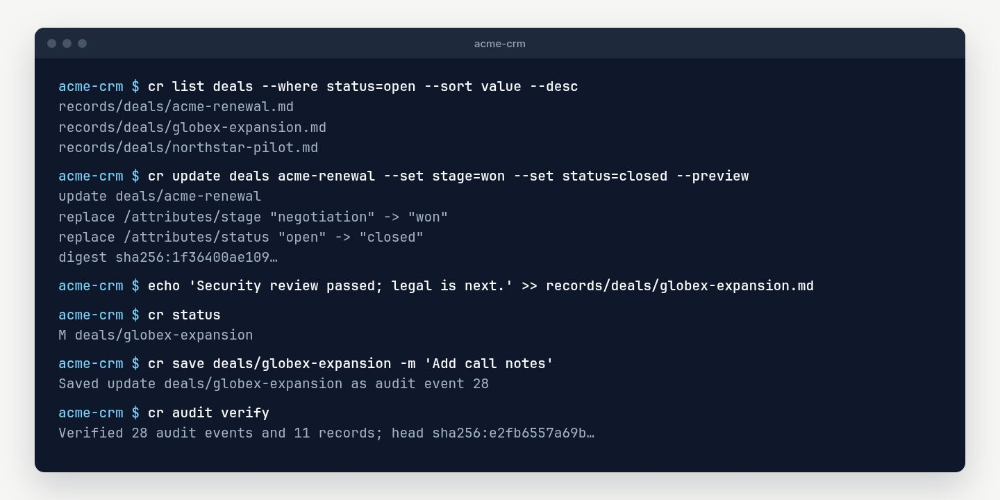

# Working with records

Every command here runs inside a database, or anywhere with
`--database PATH`. [Getting started](getting-started.md) explains how a record
is stored, and the [command reference](cli-reference.md) lists every option.



## Create and read records

Create a record:

```sh
cr create companies acme \
  --set 'name=Acme Corporation' \
  --set 'industry=Manufacturing' \
  --set 'active=true' \
  --set 'tags=[enterprise, renewal]' \
  --body 'Account notes go here.'
```

Fetch the Markdown file:

```sh
cr get companies acme
```

Fetch the record as JSON:

```sh
cr get companies acme --json
```

Fetch one field, including a nested field:

```sh
cr get companies acme --field industry
cr get contacts jane-doe --field contact.email
```

String fields can be written as exact UTF-8 bytes, without YAML quoting or an
added trailing newline. This is useful for passing a protected value directly
to a command that reads it from standard input:

```sh
cr get secrets production-openai --field value --raw \
  | some-command --token-stdin
```

`--raw` requires `--field` and refuses non-string values. The pipe keeps the
value out of the terminal and the receiving command's argument list, but that
command can still expose what it reads. Avoid command substitution such as
`some-command --token "$(cr get ...)"`, which puts the value in a process
argument and may expose it in diagnostics.

## Update, link, and delete

Update fields or replace the Markdown body:

```sh
cr update companies acme --set 'industry=Industrial automation'
cr update companies acme --set 'active=false' --body 'Account is currently paused.'
```

Remove a field with `--unset`, using the same dotted path as `--set`. A field
that does not exist is refused, and so is setting and unsetting the same field
in one update:

```sh
cr update companies acme --unset industry --unset address.suite
```

Add a named relation from one record to another:

```sh
cr link contacts jane-doe company companies acme
```

The arguments are:

```text
cr link SOURCE_COLLECTION SOURCE_ID RELATION TARGET_COLLECTION TARGET_ID
```

Remove it again with `cr unlink`, which takes the same arguments:

```sh
cr unlink contacts jane-doe company companies acme
```

`unlink` removes every reference to that record from the relation, including
one annotated with extra keys. When the relation is left empty it is removed,
and so is `relations` once nothing is left in it, so a link followed by an
unlink leaves the file exactly as it was. Unlinking a reference that is not
there changes nothing. The target does not have to exist, which is how you
remove a relation `cr check` reports as a `dangling_link`. Both directions are
recorded as `link` events, and the change set shows whether a reference was
added or removed.

## Find what links to a record

`cr backlinks` lists every record whose relations refer to a record, and the
relations that do:

```sh
cr backlinks companies acme
# records/contacts/jane-doe.md	company
# records/deals/acme-renewal-2027.md	company
```

Plain output is the source record's path, a tab, and the relation names. Limit
the sources with `--from COLLECTION` and `--relation NAME`, filter them with
`--where` and `--where-expr` as you would a `list`, and order them with
`--sort`. `--json` adds each source's collection, ID, and front matter:

```sh
cr backlinks companies acme --from deals --where-expr 'value>=10000' --sort value --desc --json
```

The target does not have to exist, so this also finds the records still
pointing at something that was deleted. Only records you may read are listed.

## Follow relations

`cr traverse` follows relations outward from a record, breadth first, for up
to `--depth` steps (1 by default, at most 10):

```sh
cr traverse deals acme-renewal-2027 --depth 2
# deals/acme-renewal-2027
#   company: companies/acme
#     parent: companies/acme-holdings
#   primary_contact: contacts/jane-doe
#     company: companies/acme (shown above)
```

Each record is visited once, so a cycle stops where it closes and a record
reached twice is marked `(shown above)`. A reference to a record that no longer
exists is marked `(missing)`, and one you may not read `(not readable)`;
neither is followed further, and neither stops the traversal. `--relation`
(repeatable) follows only the named relations, at every step.

`--json` returns a flat graph: every record reached, once, with its depth,
status, and front matter, and every reference followed as a `from`,
`relation`, `to` edge. Add `--expand` for a nested tree instead, with each
record's linked records under `links`, keyed by relation, where it was first
reached, and a `seen: true` stub everywhere else. A traversal visits at most
1,000 records and sets `truncated` when it stops early.

Delete a record. Deletion requires confirmation and retains an audited tombstone:

```sh
cr delete companies acme --yes
```

## List and structured filtering

List a collection:

```sh
cr list companies
cr list companies --json
```

Plain output contains one relative Markdown path per line. JSON output contains only the path and front matter for each matching object; it does not include the Markdown body:

```json
[
  {
    "path": "records/deals/acme-renewal-2027.md",
    "front_matter": {
      "name": "Acme 2027 renewal",
      "stage": "won",
      "value": 25000,
      "currency": "USD"
    }
  }
]
```

Use `get COLLECTION ID` or `get COLLECTION ID --json` when you also need one record's Markdown body.

Filter using typed equality. Values retain their YAML types, dotted paths select nested fields, and multiple filters are combined with AND:

```sh
cr list companies --where 'active=true'
cr list deals --where 'stage=proposal' --where 'value=25000' --json
cr list deals --where 'stage=won' --json
cr list contacts --where 'contact.country=NL' --where 'active=true' --json
```

If your own deal model calls the field `status` instead of `stage`, use `--where 'status=won'`. Field names are entirely user-defined.

Use `--where-expr` for shared typed operators. Repeat it to combine expressions with AND, and combine it with exact `--where` filters when useful:

```sh
cr list deals --where-expr 'value>=10000' --where-expr 'stage!=lost' --json
cr list deals --where-expr 'name contains renewal'
cr list deals --where-expr 'tags contains enterprise'
cr list contacts --where-expr 'contact.email is-not-empty'
cr list deals --where 'stage=open' --sort value --desc --json
```

Supported operators are `=`, `!=`, `>`, `>=`, `<`, `<=`, `contains`, `not-contains`, `starts-with`, `ends-with`, `is-empty`, and `is-not-empty`. Ordering compares numbers numerically and strings lexicographically, which gives the expected ordering for normalized ISO dates and times. Missing fields count as empty but do not match negative operators. Use `--sort FIELD` on `list` or `search`, and add `--desc` for descending order. Dotted front matter paths and the special keys `$id`, `$collection`, and `$path` are supported; missing values remain last and record ID breaks equal-value ties. A full parenthesized `AND`/`OR`/`NOT` grammar, membership sets, multi-field sorting, and projections remain explicit roadmap work.

## Search

Search literal text across every Markdown record:

```sh
cr search 'Acme Corporation'
cr search 'distributed systems' --json
```

Search one collection, optionally after applying typed front matter filters:

```sh
cr search 'renewal' --collection deals
cr search 'seat count' --collection deals --where 'stage=proposal' --json
```

Search is literal and case-sensitive by default, so characters such as `[` and `*` have no special meaning. Add `--ignore-case` or opt into a Rust regular expression with `--regex`:

```sh
cr search 'acme' --ignore-case
cr search '^(won|closed_won)$' --collection deals --field status --regex
```

By default the exact Markdown file is searched, including its YAML front matter and body. Narrow the target when needed:

```sh
cr search 'won' --front-matter
cr search 'won' --field status
cr search 'follow up' --body --ignore-case
cr search '2027-renewal.md' --path
```

Like `list`, plain search output is one relative Markdown path per line and `--json` returns only `path` and `front_matter`. A search with no matches succeeds with empty output, or `[]` in JSON mode. Search reads current files immediately, including valid direct edits that have not yet been accepted with `cr save`.

## Edit records directly

You do not have to use `cr update`. Open any record under `records/` in a text editor and change its front matter or Markdown body.

After editing, inspect the working tree:

```sh
cr status
# M candidates/alex-smith
# A candidates/new-candidate
# D candidates/removed-candidate
```

- `M` means modified.
- `A` means added directly on disk.
- `D` means deleted directly on disk.

Reads use the current Markdown files, so `get`, `list`, and `search` can show an unsaved direct edit. Audit verification and further CLI mutations will reject the divergence until you review and save it.

Record one or more reviewed changes:

```sh
cr save candidates/alex-smith --message 'Add interview notes'
cr save candidates/new-candidate candidates/removed-candidate \
  --message 'Review recruiting file changes'
```

Record everything currently shown by `status`:

```sh
cr save --all --message 'Import reviewed editor changes'
```

Use JSON when integrating with scripts:

```sh
cr status --json
cr save candidates/alex-smith --message 'Reviewed' --json
```

`save` parses and schema-validates every selected file before recording any event. Formatting-only changes are recorded because the exact file bytes changed, even when the fields and body have the same meaning.

Do not run `cr save --all` automatically from a watcher or scheduled task. An explicit save is the point where you acknowledge that filesystem changes are legitimate rather than tampering. For unattended imports, use the validated [`cr sync`](sync.md) protocol instead of writing records and auto-accepting them.
